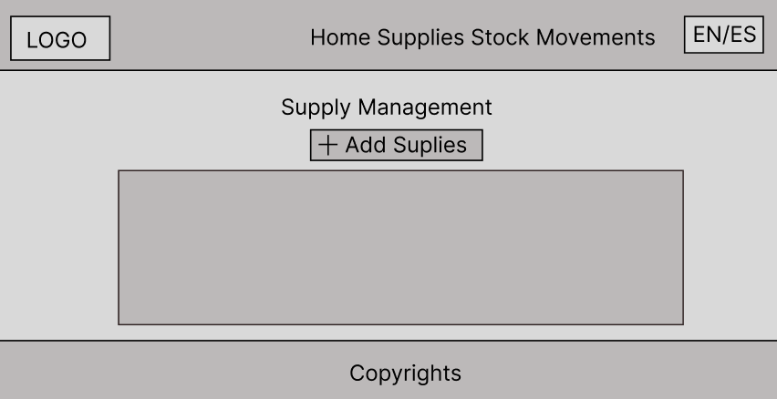

<div align="center">

<h1>Informe del Trabajo Final</h1>
<h2>Universidad Peruana de Ciencias Aplicadas</h2>

<h4>Ingenieria de Software</h4>
<h4>Desarrollo de Aplicaciones Open Source</h4>
<h4>1ASI0729-2520-7394</h4>
<h4>Docente: Hugo Allan Mori Paiva</h4>
<h4>Startup: PlusTecnical</h4>
<h4>Producto: WineSoft</h4>

## Team memebers:
|              Nombre              |   Código   |
|:--------------------------------:|:----------:|
| Oscar Diego Checa Burga    | U20231E492 |
| Yazid Said Conde                 | U202312348 |
| Christofer William Costa Morales    | U20231596 |
| July Zelmira Paico Calderon       | U20211d760 |
<h4>Ciclo 2025-02</h4>
</div>

<div>
  
## Registro de Versiones del Informe

| Versión | Fecha       | Autor                                                                                                   | Descripción de modificación |
|---------|------------|---------------------------------------------------------------------------------------------------------|-----------------------------|
| **TB1** | 18/09/2025 | Oscar Diego Checa Burga <br><br> Yazid Said Conde <br><br>Christofer William Costa Morales<br><br>July Zelmira Paico Calderon<br><br> | Para esta primera entrega, realizamos los primeros 5 capítulos del informe y desarrollamos la primera versión del landing page del Producto. |
</div>

<div>
<p>Para este informe se dividio de la siguiente forma para cada integrante del grupo:
</p>
  
  ## 
  
  |  Integrantes   | Tarea asignada |
  |:--------------:|:--------------:|
  | Yazid Said Conde |  Report capitulo 1  |
  | Oscar Diego Checa Burga |  Report capitulo 2 y 5 |
  | Christofer William Costa Morales|  Report capitulo 3  |
  | July Zelmira Paico Calderon |  Report capitulo 4  |

  ## Tabla de Contenidos

# Contenido

## [Student Outcome](#ingeniería-de-software)
## [Capítulo I: Introducción]()
* ### [1.1. Startup Profile]()
    * #### [1.1.1. Descripción de la Startup]()
    * #### [1.1.2. Perfiles de integrantes del equipo]()
* ### [1.2. Solution Profile]()
    * #### [1.2.1. Antecendentes y Problemática]()
    * #### [1.2.2. Lean UX Process]()
        * ##### [1.2.2.1. Lean UX Problem Statements]()
        * ##### [1.2.2.2. Lean UX Assumptions]()
        * ##### [1.2.2.3. Lean UX Hypothesis Statements]()
        * ##### [1.2.2.4. Lean UX Canvas]()
* ### [1.3. Segmentos objetivo]()

## [Capítulo II: Requirements Elicitation & Analysis]()
* ### [2.1. Competidores]()
    * #### [2.1.1. Análisis competitivo]()
    * #### [2.1.2. Estrategias y tácticas frente a competidores]()
* ### [2.2. Entrevistas]()
    * #### [2.2.1. Diseño de entrevistas]()
    * #### [2.2.2. Registro de entrevistas]()
    * #### [2.2.3. Análisis de entrevistas]()
* ### [2.3. Needfinding]()
    * #### [2.3.1. User Personas]()
    * #### [2.3.2. User Task Matrix]()
    * #### [2.3.3. User Journey Mapping]()
    * #### [2.3.4. Empathy Mapping]()
    * ### [2.4. Big Picture Event Storming Language]()
* ### [2.5. Ubiquitous Language]()

## [Capítulo III: Requirements Specification]()
* ### [3.1. User Stories]()
* ### [3.2. Impact Mapping]()
* ### [3.3. Product Backlog]()

## [Capítulo IV: Product Design]()
* ### [4.1. Style Guidelines]()
    * #### [4.1.1. General Style Guidelines]()
    * #### [4.1.2. Web Style Guidelines]()
* ### [4.2. Information Architecture]()
    * #### [4.2.1. Organization System]()
    * #### [4.2.2. Labeling System]()
    * #### [4.2.3. SEO Tags and Meta Tags]()
    * #### [4.2.4. Searching System]()
    * #### [4.2.5. Navigation System]()
* ### [4.3. Landing Page UI Design]()
    * #### [4.3.1. Landing Page Wireframe]()
    * #### [4.3.2. Landing Page Mock-up]()
* ### [4.4. Web Applications UX/UI Design]()
    * #### [4.4.1. Web Applications Wireframe]()
    * #### [4.4.2. Web Applications Wireflow Diagrams]()
    * #### [4.4.3. Web Applications Mock-ups]()
    * #### [4.4.4. Web Applications User Flow Diagrams]()
* ### [4.5. Web Applications Prototyping]()
* ### [4.6. Domain-Driven Software Architecture]()
    * #### [4.6.1. Software Architecture Context Diagram]()
    * #### [4.6.2. Software Architecture Container Diagram]()
    * #### [4.6.3. Software Architecture Components Diagram]()
* ### [4.7. Software Object-Oriented Design]()
    * #### [4.7.1. Class Diagrams]()
    * #### [4.7.2. Class Dictionary]()
* ### [4.8. Database Design]()
    * #### [4.8.1. Database Diagram]()

## [Capítulo V: Product Implementation, Validation & Deployment]()
* ### [5.1. Software Configuration Management]()
    * #### [5.1.1. Software Development Environment Configuration]()
    * #### [5.1.2. Source Code Management]()
    * #### [5.1.3. Source Code Style Guide & Conventions]()
    * #### [5.1.4. Software Deployment Configuration]()
* ### [5.2. Landing Page, Services & Applications Implementation]()
    * #### [5.2.1. Sprint 1]()
        * ##### [5.2.1.1. Sprint Planning 1]()
        * ##### [5.2.1.2. Aspect Leaders and Collaborators]()
        * ##### [5.2.1.3. Sprint Backlog 1]()
        * ##### [5.2.1.4. Development Evidence for Sprint Review]()
        * ##### [5.2.1.5. Execution Evidence for Sprint Review]()
        * ##### [5.2.1.6. Services Documentation Evidence for Sprint Review]()
        * ##### [5.2.1.7. Software Deployment Evidence for Sprint Review]()
        * ##### [5.2.1.8. Team Collaboration Insights during Sprint]()

## [Conclusiones]()
## [Bibliografía]()
## [Anexos]()

## Student Outcome
El curso contribuye al cumplimiento del Student Outcome
ABET – EAC - Student Outcome 3

Criterio: Capacidad de comunicarse efectivamente con un
rango de audiencias.

# Capítulo I: Introducción
## 1.1. Startup Profile
### 1.1.1. Descripción de la Startup
**WineSoft** es una startup tecnológica enfocada en el desarrollo de soluciones digitales para el sector de bebidas alcohólicas, en particular las **destilerías** y **licorerías** que enfrentan desafíos relacionados con la gestión de inventarios, trazabilidad de productos y cumplimiento regulatorio.
El proyecto surge como respuesta a la necesidad de modernizar procesos en negocios que tradicionalmente han funcionado con herramientas manuales o sistemas aislados, lo cual genera ineficiencias en control de stock, riesgos de informalidad y limitaciones para cumplir con estándares regulatorios. WineSoft se plantea como una plataforma web adaptable, orientada a pequeños y medianos empresarios, con funcionalidades que abarcan desde la gestión de inventarios y ventas, hasta la integración con entidades reguladoras para garantizar la transparencia, la autenticidad de los productos y la correcta fiscalización del rubro.

**Mision:**<br><br>
    Impulsar la transformación digital de destilerías y licorerías mediante soluciones tecnológicas accesibles y confiables que optimicen la gestión de inventarios, garanticen la trazabilidad de productos y faciliten el cumplimiento regulatorio.

**Visión:**<br><br>
    Ser la plataforma líder en digitalización del sector de bebidas alcohólicas en Latinoamérica, promoviendo negocios más eficientes, transparentes y sostenibles.

### 1.1.2. Perfiles de integrantes del equipo
| Nombre Completo del integrante   | Descripcion de Carrera                                                        | Fotografía                                  | Conocimientos y Habilidades a apuntar                                                                                                                                                                                                                                                                                                                                                                                                                                                                                                                 |
|----------------------------------|-------------------------------------------------------------------------------|---------------------------------------------|-------------------------------------------------------------------------------------------------------------------------------------------------------------------------------------------------------------------------------------------------------------------------------------------------------------------------------------------------------------------------------------------------------------------------------------------------------------------------------------------------------------------------------------------------------|
| Said Conde, Yazid                | Ingenieria de Software <br>Universidad Peruana de Ciencias Aplicadas          |   | Conocimientos en lenguajes de Programación como C++, Java, HTML, CSS, JavaScriptm, Python y C#.<br>Me considero que soy una persona muy trabajadora, responsable, puntual y respetuoso.                                                                                                                                                                                                                                                                                                                                                               |
| Christofer William Costa Morales | Ingeniería de Software<br>2024-1<br>Universidad Peruana de Ciencias Aplicadas |  | Principales conocimientos técnicos y habilidades: Conocimientos en programación C++, edición de videos en canvas, experiencia con los formatos Start up y conocimiento con los programas de Office, como Excel.                                                                                                                                                                                                                                                                                                                                       |
| Oscar Checa                      | Ingenieria de Software <br>Universidad Peruana de Ciencias Aplicadas          |      | Me considero una persona responsable y paciente. Tengo conocimientos en C++, Python y un poco de JavaScript.                                                                                                                                                                                                                                                                                                                                                                                                                                          |
| July Zelmira Paico Calderon   | Ingeniería de Software <br>Universidad Peruana de Ciencias Aplicadas     |  | Conocimientos en lenguajes de Programación como C++, Java, HTML, CSS, JavaScript, Python y C#.<br> Me gusta mucho la gestión de proyectos y organizar mi tiempo para alcanzar los objetivos planteados. En mis tiempos libres suelo aprender cosas nuevas en plataformas en línea y así fortalecer mi aprendizaje.|
                                                                                                                                      

## 1.2. Solution Profile

### 1.2.1. Antecedentes y problemática

### Antecedentes

En el sector de la producción y distribución de bebidas alcohólicas, especialmente en destilerías y licorerías, una mala gestión de insumos puede traer consecuencias económicas y operativas importantes. La falta de control en el inventario de materias primas como azúcar, alcohol base, levaduras o esencias puede generar sobrecostos, pérdidas por caducidad, deterioro por condiciones de almacenamiento inadecuadas o interrupciones en la producción. Según la Food and Agriculture Organization (FAO, 2021), hasta el 14% de las pérdidas en cadenas de suministro de alimentos y bebidas provienen justamente de fallas en la gestión de inventarios y almacenamiento inadecuado, lo que confirma la magnitud del problema en este sector.

Un caso frecuente en pequeñas y medianas licorerías ocurre cuando los insumos perecederos, como frutas o aditivos, no son monitoreados correctamente ni en cantidad ni en condiciones ambientales. Esto provoca que se echen a perder antes de ser utilizados, afectando tanto la calidad del producto final como la continuidad de la producción. La situación se agrava porque la mayoría de negocios todavía gestionan insumos mediante métodos manuales como hojas de Excel o registros físicos, sin alertas ni integración de sensores. De acuerdo con Gartner (2022), más del 60% de las PYMEs en Latinoamérica siguen utilizando hojas de cálculo para manejar inventarios, lo que incrementa la probabilidad de errores, genera ineficiencias logísticas y retrasa la toma de decisiones.

Además, la informalidad en los procesos logísticos dificulta la coordinación entre proveedores y dueños de licorerías. Los proveedores muchas veces no cuentan con información en tiempo real sobre las necesidades de sus clientes, ni con herramientas para gestionar su propio almacén de forma integrada, lo que retrasa entregas críticas y genera quiebres de stock. Esto abre un espacio para plataformas digitales más accesibles que integren funciones de control de inventario, monitoreo de almacenamiento y gestión logística compartida entre proveedores y dueños.


### Problemática

Para entender la necesidad del proyecto, se aplicó la técnica de las 5W's + 2H's:

### What (¿Cuál es el problema?):

Los dueños de licorerías y destilerías presentan dificultades en la gestión de sus almacenes de insumos, lo que puede ocasionar desperdicio por caducidad, deterioro por condiciones de almacenamiento inadecuadas, sobrecostos por compras urgentes o interrupciones en la producción.

Por otro lado, los proveedores enfrentan problemas para anticipar la demanda de sus clientes, ya que no tienen visibilidad de sus inventarios ni de las condiciones de almacenamiento en tiempo real, además de carecer de herramientas para administrar de manera eficiente su propio stock, lo cual genera retrasos en la entrega y desorganización logística.

### When (¿Cuándo ocurre el problema?):

Cuando los dueños necesitan producir, a veces descubren que insumos clave como frutas, aditivos o alcohol base están por acabarse, ya vencieron o se deterioraron por falta de control en las condiciones de almacenamiento. Esto les genera retrasos y pérdidas si no tienen un control claro.

En el caso de los proveedores, el problema surge cuando intentan reabastecer los almacenes sin tener información clara sobre el inventario y estado de conservación de sus clientes, además de tener que operar su propio almacén con registros desactualizados. Esto provoca retrasos en los envíos, problemas para coordinar entregas y mayor riesgo de incumplir tiempos de entrega.

### Where (¿Dónde ocurre el problema?):

En los almacenes físicos de los dueños de licorerías, donde actualmente el control suele hacerse de forma manual en papel o Excel, sin capacidad para monitorear condiciones ambientales.

En los almacenes de los proveedores, quienes no tienen visibilidad de los niveles de stock ni de las condiciones de almacenamiento de sus clientes y carecen de integración para coordinar reabastecimientos oportunos, además de gestionar su propio stock con sistemas básicos o manuales.

### Who (¿A quién o quiénes afecta el problema?):

A los dueños de destilerías y licorerías, que enfrentan pérdidas por insumos desperdiciados, paradas en la producción o baja calidad en sus productos.

A los proveedores de insumos, que lidian con problemas logísticos, deterioro de insumos en sus propios almacenes y pérdida de ventas por no contar con información precisa y actualizada.

De forma indirecta, a los clientes finales, que pueden recibir productos tarde o con calidad variable por interrupciones en el proceso de fabricación.

### Why (¿Por qué sucede el problema?):

- Porque muchos negocios del sector todavía manejan sus insumos de forma manual y sin conexión con sus proveedores.

- Al no contar con una plataforma que centralice la información, se generan errores, demoras en la reposición y costos operativos más altos.

### 2H's

### How (¿Cómo aparece el problema?):

Los dueños suelen registrar insumos en hojas de Excel o apuntes físicos, que se desactualizan rápidamente y carecen de alertas inteligentes o control de condiicones de almacenamiento. Esto hace que detecten vencimientos, deterioros o quiebres de stock demasiado tarde.

Por su parte, los proveedores no pueden anticipar las necesidades de reposición ni gestionar de forma eficiente su propio inventario, ya que dependen de pedidos tardíos de los clientes y de registros manuales. Esto genera desorganización en la preparación de envíos y aumenta el riesgo de incumplir tiempos de entrega.

### How Much (¿Cuánto afecta el problema?):

El impacto es significativo tanto en lo económico como en lo operativo:

- Para los dueños, un lote de frutas o aditivos vencidos puede representar pérdidas de cientos de dólares y la detención de la producción por varios días si faltan insumos críticos.

- Para los proveedores, la falta de visibilidad de inventarios provoca sobrecostos en logística, retrasos en entregas y pérdida de confianza de los clientes, lo que limita su competitividad en el mercado.


### 1.2.2. Lean UX Process

#### 1.2.2.1. Lean UX Problem Statements

El estado actual de la gestión de inventarios en destilerías y licorerías pequeñas y medianas se ha centrado principalmente en registros manuales de insumos críticos con procesos aislados entre dueños y proveedores. Esto genera pérdidas económicas por caducidad, deterioro por malas condiciones de almacenamiento, retrasos en la producción y falta de visibilidad en la cadena de suministro.

Lo que los productos y servicios existentes no abordan es la necesidad de una solución accesible que conecte en tiempo real a los dueños de negocios con sus proveedores, permitiendo un control más ágil de insumos perecederos, condiciones de almacenamiento como temperatura y humedad, y una reposición anticipada sin depender de pedidos tardíos.

Nuestro producto, WineSoft, abordará esta brecha mediante una plataforma digital que centraliza la gestión de inventarios, habilita alertas de stock y vencimiento, permite monitorear condiciones de almacenamiento críticas, otorga a los proveedores visibilidad de las necesidades de sus clientes para optimizar sus entregas, y la necesidad de mantener costos viables para las operaciones.

Nuestro enfoque inicial será pequeños y medianos dueños de licorerías en Perú y Latinoamérica, junto con sus proveedores de insumos básicos.

Sabremos que tenemos éxito cuando veamos que al menos el 70% de los usuarios logren reducir pérdidas por caducidad en un 20%, y que los proveedores mejoren sus tiempos de reabastecimiento en un 30% gracias a la integración con la plataforma.

#### 1.2.2.2. Lean UX Assumptions

**Business Assumptions:**
1. Nuestros clientes necesitan procesos más eficientes para gestionar inventarios y coordinar insumos,

2. Pensamos que estas necesidades pueden resolverse con una aplicación web que centralice el inventario, conecte dueños con proveedores y habilite funciones de monitoreo de temperatura y humedad.

3. Nuestros clientes iniciales serán pequeños y medianos dueños de licorerías y destilerías en Perú y Latinoamérica, junto con sus proveedores que atienden su demanda directa.

4. El valor principal para dueños será evitar pérdidas y mantener stock; para proveedores, obtener visibilidad de la demanda y un control de su propio inventario.

5. Captaremos clientes mediante alianzas, referidos y estrategias digitales.

6. Generaremos ingresos con un modelo de suscripción mensual, escalado según el tamaño del negocio.

7. La competencia serán sistemas genéricos de inventario, pero nos destacaremos por accesibilidad, simplicidad y especialización en bebidas alcohólicas.

8. El mayor riesgo es la resistencia al cambio, que mitigaremos con una interfaz intuitiva, capacitaciones y casos de éxito.

9. Reconocemos que si los dueños no están dispuestos a pagar por un servicio especializado, el proyecto podría fracasar, por lo que validaremos su aceptación desde el inicio.

**User Assumptions:**

1. Nuestros usuarios serán dueños y administradores de licorerías y destilerías, además de proveedores.

2. Nuestro producto encajará en la gestión diaria de inventarios, abastecimiento y control de condiciones de almacenamiento.

3. Nuestro producto resolverá pérdidas por caducidad, desabastecimiento, deterioro por malas condiciones y falta de control del stock.

4. Nuestro producto se usará de forma constante al abrir y cerrar el negocio para revisar inventarios, pedidos y el estado de almacenamiento.

5. Las características más importantes serán facilidad de uso, alertas automáticas y reportes claros.

6. Nuestro producto deberá verse simple, intuitivo y confiable para usuarios con poca experiencia tecnológica.

**Business Outcome Assumptions:**

- Incrementar la eficiencia en la gestión de inventarios, reduciendo pérdidas por caducidad y deterioro de insumos críticos en licorerías y destilerías.
  
- Mejorar la visibilidad de la demanda para los proveedores, optimizando la planificación y tiempos de entrega de insumos, además de gestionar sus propios almacenes con precisión.
  
- Reducir costos operativos asociados a compras urgentes o desperdicio de materiales, aumentando la rentabilidad de los negocios.
  
- Incrementar la confianza de los dueños en sus decisiones de reabastecimiento mediante información actualizada en tiempo real.

**User Outcome Assumptions:**

- Los dueños de licorerías podrán monitorear sus inventarios y condiciones de almacenamiento de manera rápida y precisa, evitando faltantes, pérdidas por caducidad o deterioro.

- Los proveedores podrán anticipar la demanda de sus clientes y gestionar su propio inventario de forma centralizada, optimizando rutas y cantidades de envío, lo que mejora la eficiencia de sus operaciones.

- La integración de la información en una plataforma centralizada permitirá una comunicación fluida entre dueños y proveedores, evitando retrasos o errores en la reposición de insumos.
  
**Features:**

- Implementar una función de gestión de inventarios con alertas de stock bajo, vencimientos próximos y condiciones de almacenamiento.

- Crear paneles de control para proveedores con visibilidad de necesidades de reposición de cada cliente y gestión de su propio almacén.

- Automatizar reportes de consumo, caducidad, deterioro y movimientos de inventario.v

- Registrar y mostrar historial de movimientos de inventario y entregas para análisis operativo y control

#### 1.2.2.3. Lean UX Hypothesis Statements

**Hipótesis 1:** 

**Creemos que** la reducción de costos por insumos vencidos o faltantes **se logrará si** los dueños de licorerías y destilerías **obtienen** un mejor control de sus inventarios y evitan caducidades **con** una funcionalidad de gestión de inventarios que genere alertas automáticas de bajo stock y próximos vencimientos.

**Hipótesis 2:**

**Creemos que** la mejora en los tiempos y eficiencia de entrega de los proveedores **se logrará si** los proveedores de insumos **obtienen** visibilidad en tiempo real de la demanda de sus clientes **con** un panel de control que muestre las necesidades de reposición de cada cliente.

**Hipótesis 3:**

**Creemos que** el aumento de la confianza en la toma de decisiones de negocio **se logrará si** los dueños de licorerías y destilerías **obtienen** información clara y actualizada sobre consumo y tendencias de caducidad **con** una funcionalidad de reportes automáticos de movimientos de inventario.

**Hipótesis 4:**

**Creemos que** la reducción de ineficiencias operativas y pérdidas se logrará si los dueños y proveedores **obtienen** trazabilidad y control en la cadena de suministro con una funcionalidad que registre y muestre el historial de movimientos de inventario y entregas.

**Hipótesis 5:**

**Creemos que** la mejora en la planificación y disponibilidad de insumos para la venta **se logrará si** los proveedores de insumos **obtienen** un control centralizado de su propio inventario **con** una funcionalidad de gestión de almacén integrada en la plataforma.

**Hipótesis 6:**

**Creemos que** la reducción de pérdidas por deterioro de insumos perecederos **se logrará si** los dueños de licorerías y destilerías **obtienen** alertas en tiempo real sobre temperatura y humedad fuera de rango **con** una funcionalidad de monitoreo ambiental conectada a sensores IoT.

**Hipótesis 7:**

**Creemos que** la mejora en la puntualidad y trazabilidad de las entregas **se logrará si** los proveedores de insumos **obtienen** la capacidad de coordinar y actualizar en tiempo real el estado de sus envíos tras recibir solicitudes de reposición **con** una funcionalidad de gestión logística integrada que permita gestionar rutas y actualizar estados


#### 1.2.2.4. Lean UX Canvas


Enlace al tablero de desarrollo: https://miro.com/app/board/uXjVJMXI8fo=/?share_link_id=240561883449

## 1.3. Segmentos objetivo  

### Segmento 1: Dueños de destilerías y licorerías  

- **Descripcion:** Este segmento está conformado por pequeños y medianos empresarios dedicados a la producción y/o comercialización de bebidas alcohólicas. Gestionan un almacén virtual para controlar insumos de producción, registrar cantidades, fechas de vencimiento y condiciones de almacenamiento. También reciben alertas de insumos próximos a agotarse o caducar y confirman la recepción de pedidos enviados por proveedores.
  
- **Sexo:** Masculino y femenino
  
- **Edades:** Adultos jóvenes (25-40 años) y adultos de mediana edad (41-60 años).
  
- **Nivel socioeconómico:** Principalmente clases B y C (media-alta y media).
  
- **Necesidades:** Reducir pérdidas económicas por insumos vencidos, asegurar la trazabilidad de inventarios, optimizar la reposición de stock y mantener condiciones de almacenamiento adecuadas. Esto les permite operar con mayor eficiencia, cumplir estándares de calidad y asegurar la continuidad de la producción. En la industria de bebidas del Perú, el 96,3 % de las empresas son microempresas, el 2,3 % pequeñas y solo el 1,4 % medianas o grandes (Sociedad Nacional de Industrias SNI, 2022).

### Segmento 2: Entidades regulatorias  

- **Descripcion:** Empresas o distribuidores medianos que abastecen insumos a destilerías y licorerías, contando además con flota propia para el transporte. Administran su propio almacén en la plataforma, visualizan los inventarios de los clientes, generan pedidos de reposición y gestionan envíos actualizando estados de entrega. También acceden a historiales de movimientos para mejorar la planificación logística.
  
- **Sexo:** Masculino y femenino
  
- **Edades:** Adultos jóvenes (25-40 años) y adultos de mediana edad (41-55 años)
  
- **Nivel socioeconómico:** Principalmente clases B y C (media-alta y media).
  
- **Necesidades:** Mejorar la eficiencia logística, anticipar la demanda de los clientes, planificar entregas de forma más precisa y garantizar que los envíos lleguen en tiempo y forma. Esto contribuye a fidelizar a las destilerías, optimizar recursos de transporte y aumentar la rentabilidad.

# Capítulo II: Requirements Elicitation & Analysis
## 2.1. Competidores.
<table border="1px">
        <thead>
            <th colspan="11">Competitive Analysis Landscepe</th>
        </thead>
        <tbody>
            <tr>
                <td rowspan="2" colspan="2">¿Por qué llevar a
                    cabo este análisis?</td>
            </tr>
            <tr>
                <td colspan="9">El objetivo de este análisis es comprender el funcionamiento, los enfoques y las características de los productos ofrecidos por competidores en el sector tecnológico aplicado a destilerías y bebidas alcohólicas. Esto permitirá planificar estrategias que resalten las fortalezas de WineSoft y aprovechen las debilidades de las soluciones actuales en el mercado.     </td> 
            </tr>
            <tr>
                <tr>
                    <td colspan="3">(En la cabecera colocar por cada competidor nombre y logo)</td>
                    <td colspan="2"><br>WineSoft</td>
                    <td colspan="2"><br>BottlePOS</td>
                    <td colspan="2"><br>Korona POS</td>
                    <td colspan="2"><br>WinePOS</td>
                </tr>
            </tr>
            <tr>
                <td rowspan="2" colspan="1">Perfil</td>
                <td colspan="2">Overview</td>
                <td colspan="2">Plataforma que digitaliza la operación de licorerías y destilerías mediante gestión de inventarios, monitoreo de condiciones de almacenamiento con IoT simulado, registro de cumplimiento regulatorio.</td>
                <td colspan="2">POS verticalizado diseñado específicamente para licorerías, con funcionalidades como verificación de edad, control de lotes y workflows de caja adaptados al comercio de alcohol.</td>
                <td colspan="2">POS flexible para retail con módulos para tiendas de bebidas, licorerías y supermercados, con énfasis en inventario avanzado, analíticas y escalabilidad.</td>
                <td colspan="2">Soluciones de nicho orientadas a vinos y licores, con gestión de inventario por lote y funciones para tiendas boutique y distribuidores especializados.</td>
            </tr>
            <tr>
                <td colspan="2"> Ventaja competitiva <br></br> ¿Qué valor ofrece a los clientes?</td>
                <td colspan="2">Solución en el mercado que ofrece una combinación de gestión operativa con IoT y cumplimiento normativo. Permite a las empresas generar evidencias digitales de limpieza, control ambiental y trazabilidad; y a los reguladores acceder directamente a la información para verificar estándares de seguridad y autenticidad.</td>
                <td colspan="2">Su fortaleza radica en la simplicidad y en la adaptación al día a día de las licorerías, con funciones específicas para ventas de bebidas alcohólicas.</td>
                <td colspan="2">Adaptable a cadenas y negocios medianos/grandes, con herramientas de multi-sucursal, promociones y fidelización de clientes.</td>
                <td colspan="2">Se centra en detalles que importan a tiendas boutique: variantes por añada, fichas técnicas, gestión de catas y fidelización de clientes.</td>
            </tr>
            <tr>
                <td rowspan="2" colspan="1">Perfil de Marketing</td>
                <td colspan="2">Mercado Objetivo</td>
                <td colspan="2">Licorerías, destilerías y distribuidores medianos en Perú y Latinoamérica que necesitan mejorar control operativo, demostrar cumplimiento ante reguladores y reducir riesgos de sanciones.</td>
                <td colspan="2">Licorerías pequeñas y medianas que buscan control operativo sin preocuparse de regulaciones avanzadas.</td>
                <td colspan="2">Retailers medianos y grandes, cadenas de licorerías y negocios con planes de expansión.</td>
                <td colspan="2">Tiendas boutique de vinos, licorerías especializadas, importadores y distribuidores con inventarios por añadas.</td>
            </tr>
            <tr>
                <td colspan="2">Estrategia de Marketing</td>
                <td colspan="2">Implementación piloto con municipalidades, campañas digitales orientadas a la formalización del sector, alianzas con gremios de productores y demostraciones en ferias tecnológicas y de bebidas.</td>
                <td colspan="2">Marketing directo en ferias de retail, asociaciones de licorerías y demostraciones presenciales.</td>
                <td colspan="2">Estrategia B2B mediante marketing digital, ferias de retail, partnerships con proveedores de hardware y pagos.</td>
                <td colspan="2">Posicionamiento en blogs de vino, eventos de degustación y colaboraciones con sommeliers.</td>
            </tr>
            <tr>
                <td rowspan="3" colspan="1">Perfil de Producto</td>
                <td colspan="2">Producto & Servicio</td>
                <td colspan="2">Es una aplicacion web que permite la gestión de inventario con trazabilidad por lote y tipo de producto, integrando un módulo de IoT simulado para la medición de temperatura, humedad y presión. Además, genera alertas y notificaciones automáticas ante posibles riesgos, y cuenta con un registro de limpieza con evidencias para garantizar el cumplimiento de normativas y buenas prácticas.</td>
                <td colspan="2">POS con gestión de inventario, reportes fiscales básicos, verificación de edad y control de stock por lote.</td>
                <td colspan="2">POS con inventario avanzado, analíticas, gestión multi-sucursal, promociones y e-commerce.</td>
                <td colspan="2">POS con gestión por añada/lote, herramientas para catas y gestión de eventos.</td>
            </tr>
            <tr>
                <td colspan="2">Precio & Costos  </td>
                <td colspan="2">Modelo SaaS por suscripción escalonada (planes Básico, Avanzado y Regulator), con tarifas ajustadas al tamaño de la empresa y número de almacenes</td>
                <td colspan="2">Suscripción mensual con tarifas personalizadas orientadas a pequeñas y medianas empresas.</td>
                <td colspan="2">Modelo SaaS con suscripción mensual según número de terminales y funcionalidades.</td>
                <td colspan="2">Suscripciones mensuales o licencias con costos adicionales de soporte o implementación.</td>
            </tr>
            <tr>
                <td colspan="2">Canales de distribucion (web y/o Movil)</td>
                <td colspan="2">Aplicación web</td>
                <td colspan="2">Aplicación web y aplicación móvil</td>
                <td colspan="2">Aplicación web y aplicación móvil</td>
                <td colspan="2">Aplicación web</td>
            </tr>
            <tr>
                <td rowspan="5">Analisis SWOT</td>
                <td colspan="10">Realice esto para su startup y sus competidores. Sus fortalezas deberían apoyar sus
                    oportunidades y contribuir a lo que ustedes definen como su posible ventaja
                    competitiva</td>
            </tr>
            <tr>
                <td colspan="2">Fortalezas</td>
                <td colspan="2">Diferenciación clara por IoT y cumplimiento regulatorio, interfaz pensada para usuarios no técnicos y conexión con reguladores.</td>
                <td colspan="2">Funciones específicas del rubro; facilidad de uso.</td>
                <td colspan="2">Escalabilidad, reportes avanzados, flexibilidad en integraciones.</td>
                <td colspan="2">Funcionalidad muy específica para vinos y coleccionistas.</td>
            </tr>
            <tr>
                <td colspan="2">Debilidades</td>
                <td colspan="2">Startup nueva con baja visibilidad, curva de aprendizaje para usuarios tradicionales, necesidad de validación inicial con entidades públicas</td>
                <td colspan="2">No ofrece trazabilidad, IoT ni soporte regulatorio.</td>
                <td colspan="2">Generalista; no ofrece compliance ni trazabilidad regulatoria.</td>
                <td colspan="2">Escalabilidad y soporte limitados, enfoque demasiado nicho.</td>
            </tr>
            <tr>
                <td colspan="2">Oportunidades</td>
                <td colspan="2">Creciente presión normativa en bebidas alcohólicas, digitalización en LATAM, programas de apoyo a la formalización empresarial.</td>
                <td colspan="2">Crecimiento de la digitalización en negocios pequeños.</td>
                <td colspan="2">Expansión en LATAM con retailers medianos y grandes.</td>
                <td colspan="2">Expansión a distribuidores con servicios de autenticidad digital.</td>
            </tr>
            <tr>
                <td colspan="2">Amenazas</td>
                <td colspan="2">POS consolidados con fuerte presencia de mercado, resistencia cultural a la adopción digital, cambios regulatorios que requieran ajustes rápidos.</td>
                <td colspan="2">Competencia de POS generalistas y bajo poder de diferenciación a largo plazo</td>
                <td colspan="2">Competencia de soluciones verticalizadas más económicas.</td>
                <td colspan="2">Soluciones locales más baratas o más amplias en alcance.</td>
            </tr>
        </tbody>
    </table>

### 2.1.2 Estrategias y tácticas frente a competidores.


#### Estrategia de diferenciación
WineSoft se diferencia al integrar en una sola plataforma la gestión de inventarios, control de procesos productivos y cumplimiento regulatorio, algo que los POS tradicionales (como Korona POS o Square) y los sistemas de monitoreo de fermentación (como BrewMonitor) no ofrecen de manera conjunta. El valor agregado radica en la trazabilidad digital, la validación con entidades regulatorias y la inclusión de funcionalidades IoT (simuladas en esta versión inicial) para garantizar calidad y seguridad.

**Tácticas:**
- Incluir funcionalidades clave como alertas de inventario en tiempo real, registro de limpieza con evidencia y reportes automáticos de cumplimiento normativo.  
- Desarrollar un módulo de conexión directa con proveedores autorizados para asegurar abastecimiento confiable.  
- Ofrecer un perfil específico para entidades reguladoras con acceso a datos de trazabilidad y validación.  
- Diseñar una interfaz intuitiva para usuarios con poca experiencia tecnológica, asegurando una curva de aprendizaje mínima.  

---

#### Estrategia de liderazgo en costos
WineSoft busca ofrecer una solución a un precio accesible en comparación con competidores que requieren grandes inversiones en hardware o licencias. El modelo de negocio se enfoca en suscripciones escalonadas, adaptadas al tamaño del negocio y al nivel de funcionalidades que deseen implementar.

**Tácticas:**
- Implementar un modelo freemium con registro gratuito y acceso limitado a funciones básicas de inventario.  
- Ofrecer planes de suscripción accesibles con precios diferenciados para pequeñas licorerías y destilerías medianas.  
- Evitar costos ocultos al no exigir licencias adicionales de hardware o integraciones externas costosas.  
- Garantizar soporte técnico básico incluido en el plan estándar para reducir barreras de adopción.  

---

#### Estrategia de diferenciación enfocada
WineSoft no busca competir con plataformas genéricas de gestión o POS de gran escala, sino que se especializa en el sector de bebidas alcohólicas. El enfoque está en resolver problemas específicos de trazabilidad, fiscalización y formalización, que no son prioridad para los competidores generalistas.

**Tácticas:**
- Ofrecer reportes regulatorios automáticos alineados con normativas como la Ley 28681 y la Ley 29632.  
- Incluir alertas preventivas de riesgos regulatorios (productos vencidos, lotes sin trazabilidad).  
- Adecuar la comunicación visual y verbal al sector de licores, transmitiendo formalidad y confianza en la legalidad de las operaciones.  

---

#### Estrategias competitivas adicionales
**Tácticas:**
- Incorporar un sistema de notificaciones automáticas para stock bajo, vencimiento de productos y recordatorios regulatorios.  
- Implementar reseñas y validaciones de proveedores para fortalecer la confianza entre negocios y entidades fiscalizadoras.  
- Desarrollar dashboards comparativos que muestren tendencias de ventas y consumos estacionales.  

---

#### Estrategia de construcción de marca
WineSoft apuesta por una identidad sólida vinculada con la formalidad, la innovación tecnológica y la seguridad del consumidor. A diferencia de la competencia que se enfoca en eficiencia operativa, WineSoft comunica un compromiso con la legalidad, la salud pública y la sostenibilidad del sector.

**Tácticas:**
- Diseñar una identidad visual seria pero accesible, con colores asociados a confianza y transparencia.  
- Usar redes sociales y campañas digitales para resaltar casos de éxito en formalización y trazabilidad.  
- Posicionarse como un aliado tanto de empresarios como de entidades reguladoras, fomentando comunidad alrededor de la transparencia en el mercado de licores.  

## 2.2. Entrevistas.
## 2.2.1. Diseño de entrevistas
Para el desarrollo de las entrevistas de nuestros segmentos objetivos, se pensaron en las siguientes preguntas:
### Preguntas utilizadas para las entrevistas según el segmento objetivo:
 
## Preguntas utilizadas para las entrevistas según el segmento objetivo:

## Dueño de licorerias

### Preguntas Demográficas:

- ¿Cuál es su nombre?
- ¿Qué edad tiene?
- ¿Cuál es su género?
- ¿Cuál es su distrito/provincia de residencia?
- ¿Cuál es su ocupación?
  
### Preguntas principales:

- ¿Qué tipo de bebidas representan la mayor parte de sus ventas?
- ¿Cuáles son los productos que más rápido se agotan y cuáles suelen quedarse en stock?
- ¿Cómo decide qué nuevos productos incorporar a su catálogo?
- ¿Qué dificultades encuentra al momento de controlar inventario o pedidos?
- ¿Cuánto tiempo le toma normalmente reponer stock y coordinar con proveedores?
- ¿Cómo maneja el registro de ventas: manual, hojas de cálculo o algún sistema digital?
- ¿Le interesaría contar con un sistema que le permita tener control en tiempo real del stock?
- ¿Le ayudaría un sistema que lo conecte directamente con proveedores autorizados para simplificar la reposición?
- ¿Cree que un software como WineSoft podría ahorrarle tiempo administrativo para dedicarse más a sus clientes?
  
### Preguntas complementarias:

- ¿Qué tan valioso sería para usted recibir reportes automáticos de los productos más vendidos y menos rotativos?
- ¿Qué tanto le impacta la informalidad o competencia desleal en precios y productos adulterados?
- ¿Ha detectado cambios recientes en las preferencias de sus clientes?
  
## Proveedores del sector licorero

### Preguntas Demográficas:

- ¿Cuál es su nombre?
- ¿Qué edad tiene?
- ¿Cuál es su género?
- ¿Cuál es su distrito/provincia de residencia?
- ¿Por qué decidió trabajar en el rubro de proveedores para destilerías o licorerías?
  
### Preguntas principales:

- ¿Cuáles son los principales productos o servicios que ofrece a las destilerías?
- ¿Cómo gestionan la trazabilidad de sus productos desde el origen hasta la entrega?
- ¿Con qué frecuencia reciben pedidos o demandas de sus productos por parte de las licorerías?
- ¿Cuáles considera que son los mayores retos logísticos que enfrentan actualmente?
- ¿Qué nivel de digitalización tiene su gestión de inventario y pedidos?
- ¿Cómo evalúan la importancia de cumplir con las normativas sanitarias en su rubro?
- ¿Cuál es su percepción sobre la adopción de herramientas digitales dentro del rubro proveedor-destilería?
- ¿Qué beneficios o barreras identifica en el uso de plataformas tecnológicas para la gestión de pedidos y trazabilidad?
- ¿Cómo perciben el impacto que puede tener un fallo o retraso en su cadena de suministros?
- ¿Estaría interesado en utilizar una plataforma digital que centralice los pedidos, gestione la trazabilidad de los productos y optimice la comunicación con las licorerías?
- ¿Qué tan dispuesto estaría a compartir información sobre la calidad o procedencia de sus insumos con sus clientes (licorerías o destilerías)?
- ¿Estaría interesado en utilizar una plataforma digital que centralice los pedidos, gestione la trazabilidad de los productos y optimice la comunicación con las licorerías?
  
### Preguntas complementarias:

- ¿Qué tipo de valor agregado buscan transmitir en su relación con los socios comerciales o licorerías?
- ¿Con qué frecuencia reciben solicitudes de personalización de productos por parte de las licorerías o clientes?
- ¿Qué tipo de información considera más valiosa sobre sus producto?
- ¿Qué dificultades enfrentan al realizar servicios de transporte o entrega en zonas alejadas?
- ¿Qué mejoras considera necesarias en la relación entre proveedores y licorerías?

 ##  2.2.2. Registro de entrevistas
A continuación, se presentará un resumen de cada entrevista. Además, por cada entrevista se colocará una captura de pantalla de evidencia y el intervalo de tiempo de duración que tienen en el video.

**Segmento Objetivo: Dueño de licoreria y destilería**

**Entrevista 1: Fernando Teves**


**Datos del entrevistado**
* **Nombre:** Fernando Teves
* **Edad:** --
* **Estado civil:** --
* **Ocupación:** --
* **Distrito de Residencia:** --

* **Duración de la entrevista:** [00:00:00 - 00:00:00]
* **Video de las entrevistas:** [Needfinding - Interviews](link de video)

**Resumen de la entrevista:**
- El ingeniero Fernando Teves explicó que dentro de su fábrica el producto más demandado es el anisado, seguido de algunas variedades de licores artesanales. Mencionó que las bebidas que más rápido se agotan son los productos tradicionales de mayor aceptación, mientras que ciertos licores importados o de nicho suelen quedarse más tiempo en stock.

- Señaló que ha percibido cambios en las preferencias de sus clientes: actualmente hay un mayor interés por bebidas artesanales y de producción local, mientras que algunos destilados convencionales han perdido fuerza. Al momento de incorporar nuevos productos, se guía tanto por las tendencias del mercado como por la retroalimentación directa de sus clientes.

- En cuanto a la gestión, reconoció que uno de los principales retos es el control de inventario y pedidos, ya que muchas veces se hace de forma manual y le toma tiempo reponer stock y coordinar con proveedores. Comentó que todavía utiliza herramientas simples como hojas de cálculo, lo que limita la rapidez de las operaciones.

- Finalmente, mostró interés en un sistema como WineSoft, destacando que sería muy valioso contar con un control en tiempo real de ventas e inventario, recibir reportes automáticos de productos más vendidos y, sobre todo, conectarse directamente con proveedores autorizados para agilizar la reposición. Considera que esto le permitiría ahorrar tiempo administrativo y dedicar más esfuerzo a los clientes y a mejorar la calidad de los productos.

**Entrevista 2: Gabriel**


**Datos del entrevistado**
* **Nombre:** Gabriel
* **Edad:** --
* **Estado civil:** --
* **Ocupación:** --
* **Distrito de Residencia:** --

* **Duración de la entrevista:** [00:00:00 - 00:00:00]
* **Video de las entrevistas:** [Needfinding - Interviews](link de video)

**Resumen de la entrevista:**

- En la entrevista, Gabriel, quien trabaja con su madre en un negocio de insumos para licorerías y destilerías, explicó que ofrecen principalmente alcohol puro, botellas, tapas y equipos de destilación, gestionando la trazabilidad con documentos oficiales y códigos QR. Señaló que la demanda varía según la temporada, enfrentan retos logísticos como transporte inseguro y condiciones de almacenamiento, y actualmente manejan inventarios con Excel. Destacó que los clientes valoran la pureza, el origen certificado y los precios, además de la puntualidad en las entregas, y mencionó la importancia de cumplir con normativas sanitarias. Reconoció el interés en adoptar herramientas digitales, mejorar la comunicación y diversificar pagos, y se mostró dispuesto a integrarse en plataformas que optimicen pedidos, trazabilidad y costos.

**Segmento Objetivo: Entidad Reguladora**

**Entrevista 1: Leslie Kasimiro**


**Datos del entrevistado**
* **Nombre:** Leslie Kasimiro
* **Edad:** --
* **Estado civil:** --
* **Ocupación:** --
* **Distrito de Residencia:** --

* **Duración de la entrevista:** [00:00:00 - 00:00:00]
* **Video de las entrevistas:** [Needfinding - Interviews](link de video)

**Resumen de la entrevista:**

- Leslie Kasimiro explicó que el sector de licorerías está regulado principalmente por la Ley 28681 (sobre venta y consumo de alcohol), la Ley 29632 (control de bebidas adulteradas) y las ordenanzas municipales que establecen horarios y licencias. Añadió que una de las mayores dificultades es la alta informalidad, la escasez de fiscalizadores y la falta de un padrón único de negocios, ya que la información se encuentra dispersa entre municipalidades y SUNAT.

- Sobre la trazabilidad, detalló que se apoya en los registros sanitarios (DIGESA) y en los registros de comercializadores (PRODUCE), además de los operativos multisectoriales. Las sanciones más comunes incluyen multas, clausuras, decomisos e incluso denuncias penales en casos graves de adulteración.

- Señaló que la informalidad y el contrabando generan pérdidas tributarias y riesgos para la salud pública, reflejados en intoxicaciones y ventas a menores. Sin embargo, también destacó que existen avances como las ventanillas digitales y los registros en línea, que facilitan los trámites a los dueños de negocios. Asimismo, mencionó que se realizan campañas de capacitación y operativos preventivos.

- Respecto al futuro, afirmó que la digitalización es clave para mejorar la fiscalización, ya que facilita cruces de datos y la trazabilidad. Consideró que un software como WineSoft puede ser muy útil, siempre que valide proveedores, registre ventas en tiempo real y garantice la protección de datos. A mediano plazo, proyecta que habrá más interoperabilidad entre entidades públicas, mejor trazabilidad digital y fiscalizaciones más focalizadas.
  
## 2.2.3. Análisis de entrevistas  
### Segmento 1: Dueños de licorerías y destilerías (N=3)  

#### Características Objetivas (cuantificables)  

**1. Tipos de bebidas más vendidas**  
- Licores tradicionales (anisado, ron, whisky): **67%** (2 de 3 entrevistados).  
- Licores artesanales / vinos locales: **67%** (2 de 3 entrevistados).  
- Licores importados o de nicho: **67%** (2 de 3 entrevistados, aunque con menor rotación).  

**2. Productos con mayor rotación**  
- Bebidas artesanales y tradicionales: **100%** (3 de 3 entrevistados reportan alta rotación).  
- Licores importados de alto costo: **67%** (2 de 3 entrevistados los identifican como baja rotación).  

**3. Cambios recientes en preferencias de clientes**  
- Mayor interés en bebidas artesanales / producción local: **67%** (2 de 3 entrevistados).  
- Preferencia estable por licores tradicionales: **33%** (1 de 3 entrevistados).  

**4. Criterios para incorporar nuevos productos**  
- Retroalimentación de clientes: **67%** (2 de 3 entrevistados).  
- Tendencias de mercado y temporadas: **67%** (2 de 3 entrevistados).  
- Certificación y trazabilidad del producto: **33%** (1 de 3 entrevistados).  

**5. Dificultades en la gestión de inventario y pedidos**  
- Procesos manuales generan errores y pérdida de tiempo: **67%** (2 de 3 entrevistados).  
- Dependencia de hojas de cálculo no integradas: **67%** (2 de 3 entrevistados).  
- Problemas logísticos (transporte, almacenamiento inseguro): **33%** (1 de 3 entrevistados).  

**6. Tiempo de reposición de stock**  
- Entre 3 y 5 días en promedio: **67%** (2 de 3 entrevistados).  
- Más de 5 días en temporadas de alta demanda: **33%** (1 de 3 entrevistados).  

**7. Método de registro de ventas**  
- Hojas de cálculo (Excel): **67%** (2 de 3 entrevistados).  
- Registros manuales en papel: **33%** (1 de 3 entrevistados).  
- Sistemas digitales integrados: **0%** (ningún entrevistado).  

**8. Impacto de la informalidad**  
- Alta competencia desleal por precios bajos y alcohol adulterado: **67%** (2 de 3 entrevistados).  
- Reconocimiento del problema pero sin afectación directa: **33%** (1 de 3 entrevistados).  

**9. Interés en digitalización (WineSoft)**  
- Interés en control en tiempo real de inventario y ventas: **100%** (3 de 3 entrevistados).  
- Valoración de reportes automáticos para identificar productos con mayor/menor rotación: **100%** (3 de 3 entrevistados).  
- Conexión directa con proveedores autorizados: **100%** (3 de 3 entrevistados).  
- Ahorro de tiempo administrativo para dedicarse al cliente: **100%** (3 de 3 entrevistados).  

#### Síntesis del segmento  

El segmento de dueños de licorerías y destilerías muestra un patrón común de gestión manual y semi-digital (Excel) con dificultades significativas en inventario y reposición. El 100% de los entrevistados manifestó interés en adoptar soluciones digitales, destacando la necesidad de control en tiempo real, reportes automáticos y conexión con proveedores confiables. Asimismo, se identificó que la informalidad y la competencia desleal son amenazas constantes que refuerzan la importancia de un sistema que promueva la trazabilidad y la formalización. WineSoft responde directamente a estas necesidades, posicionándose como una herramienta clave para mejorar la eficiencia y la sostenibilidad de estos negocios.  

### Segmento 2: Entidad Reguladora (N=3)  

#### Características Objetivas (cuantificables)  

**1. Normas principales aplicadas**  
- Ley 28681 (venta y consumo de alcohol): **67%** (2 de 3 entrevistados).  
- Ley 29632 (control de bebidas adulteradas): **67%** (2 de 3 entrevistados).  
- Ordenanzas municipales (horarios, licencias): **67%** (2 de 3 entrevistados).  
- Reglamentos sanitarios / DIGESA: **33%** (1 de 3 entrevistados).  

**2. Dificultades en la supervisión**  
- Falta de fiscalizadores / personal: **67%** (2 de 3 entrevistados).  
- Informalidad generalizada de pequeños negocios: **100%** (3 de 3 entrevistados).  
- Dispersión geográfica y limitación de alcance: **33%** (1 de 3 entrevistados).  

**3. Métodos actuales de trazabilidad**  
- Registros sanitarios y comercializadores (DIGESA/PRODUCE): **67%** (2 de 3 entrevistados).  
- Control documental/manual (facturas, guías): **67%** (2 de 3 entrevistados).  
- Etiquetas y códigos QR: **33%** (1 de 3 entrevistados).  

**4. Sanciones más comunes**  
- Multas: **100%** (3 de 3 entrevistados).  
- Clausuras / incautaciones: **67%** (2 de 3 entrevistados).  
- Cancelación de permisos / denuncias penales: **33%** (1 de 3 entrevistados).  

**5. Nivel de informalidad estimado**  
- 40–50% de negocios informales: **67%** (2 de 3 entrevistados).  
- 30% de alcohol proveniente de contrabando: **33%** (1 de 3 entrevistados).  

**6. Programas de formalización y capacitación**  
- Ventanillas digitales/licencias express: **67%** (2 de 3 entrevistados).  
- Talleres o campañas de capacitación: **67%** (2 de 3 entrevistados).  
- Atención limitada en provincias: **33%** (1 de 3 entrevistados).  

**7. Digitalización y futuro**  
- Digitalización clave para fiscalización: **100%** (3 de 3 entrevistados).  
- Interoperabilidad con sistemas públicos: **67%** (2 de 3 entrevistados).  
- Expectativas de usar blockchain/IoT: **33%** (1 de 3 entrevistados).  

---
### Síntesis del segmento  

La entidad reguladora reconoce como principales retos la informalidad (40–50% del mercado) y la falta de fiscalización efectiva. Actualmente, dependen de registros sanitarios y controles manuales, lo cual limita la trazabilidad. El 100% de los entrevistados considera que la digitalización es clave para el futuro del sector y coincide en que un software como WineSoft puede ser un aliado estratégico para mejorar la trazabilidad, reducir la informalidad y fortalecer el cumplimiento normativo.  

## 2.3. Needfinding.

### 2.3.1. User Personas.

Con el propósito de garantizar una comprensión profunda y precisa de los segmentos identificados como clave para nuestro proyecto, hemos llevado a cabo un proceso estructurado y cuidadoso de creación de User Personas. Este procedimiento nos permitió definir un perfil específico y representativo para cada segmento objetivo, lo que nos brinda una perspectiva más clara y detallada de nuestros usuarios. De esta manera, podemos diseñar y ofrecer soluciones que respondan de manera efectiva a sus necesidades, expectativas y contextos particulares.

- **UserPersona 1**
<br>
  
<br>

- **UserPersona 2**
    <br>
    
    <br>

### 2.3.2. User Task Matrix.

<div style='text-align: justify;'>

El **User Task Matrix** concentra las tareas que los **User Persona**, que representan a los segmentos principales de WineSoft, realizan para cumplir sus objetivos dentro de la cadena de valor de bebidas alcohólicas.
En este caso, se consideran dos segmentos de usuarios:

- **Dueños de licorerías o destilerías**, encargados de la gestión operativa, el control del inventario y la relación directa con los clientes.
  
- **Proveedores**, responsables del abastecimiento, trazabilidad y cumplimiento logístico en los procesos de distribución.
  
Es importante destacar que las **tareas (tasks)** reflejan actividades que los usuarios realizan independientemente de la existencia del software, es decir, forman parte natural de su día a día y no representan características o funciones del sistema.

---

### Indicadores de Importancia y Frecuencia

#### Indicadores de Importancia:

- **ALTA** → La tarea es crítica para el cumplimiento de los objetivos del usuario.
- **MEDIA** → La tarea es importante pero no afecta directamente el resultado global.
- **BAJA** → La tarea aporta valor complementario o se realiza ocasionalmente.

#### Indicadores de Frecuencia:

- **ALTA** → Se realiza de manera constante o diaria.
- **MEDIA** → Se realiza semanal o mensualmente.
- **BAJA** → Se realiza esporádicamente o en circunstancias específicas.

---

| **Task** | **Dueños de licorerías (Frecuencia - Severidad)** | **Entidades regulatorias (Frecuencia - Severidad)** |
|----------|---------------------------------------------------|------------------------------------------------------|
| Controlar inventario de productos | Alta - Alta | Media - Alta |
| Recibir alertas de stock bajo o vencimiento | Alta - Alta | Alta - Alta |
| Registrar ventas y movimientos | Alta - Alta | Media - Alta |
| Garantizar trazabilidad de productos | Alta - Alta | Alta - Alta |
| Cumplir con normativas municipales y sanitarias | Alta - Alta | Alta - Alta |
| Generar reportes de ventas e inventario | Media - Alta | Alta - Alta |
| Conectarse con proveedores autorizados | Alta - Alta | Media - Alta |
| Detectar productos adulterados o irregulares | Media - Alta | Alta - Alta |
| Validar documentación para inspecciones | Media - Alta | Alta - Alta |
| Revisar historial de compras y rotación de productos | Media - Alta | Media - Alta |
| Acceder a datos en tiempo real para auditorías | Media - Alta | Alta - Alta |
| Evaluar riesgos de incumplimiento regulatorio | Media - Alta | Alta - Alta |
| Implementar mejoras en gestión de stock | Media - Alta | Media - Alta |
| Facilitar procesos de formalización/licencias | Media - Alta | Alta - Alta |
| Comparar desempeño con estándares de mercado | Baja - Alta | Media - Alta |


### Análisis de Tareas

#### Tareas con mayor frecuencia e importancia

Tanto **dueños de licorerías/destilerías** como **proveedores** presentan alta frecuencia e importancia en tareas como:

- **Garantizar la trazabilidad de productos,**
- **Cumplir con acuerdos comerciales y tiempos de entrega,** y
- **Recibir alertas de stock bajo o vencimiento.**
Estas tareas reflejan la necesidad de control, coordinación y comunicación constante dentro del flujo logístico y de abastecimiento.

#### Principales diferencias entre segmentos de usuarios

1. **Control de inventario:** Tiene alta frecuencia e importancia para los dueños de licorerías, ya que afecta directamente la operación diaria; para los proveedores, su frecuencia es media al centrarse más en abastecimiento que en almacenamiento.
2. **Generación de reportes:** Es una tarea de importancia alta en ambos segmentos, pero de mayor frecuencia en los proveedores, que deben rendir cuentas sobre logística y cumplimiento.
3. **Registro de ventas y movimientos:** Es esencial y frecuente para los dueños de licorerías, mientras que los proveedores la realizan con menor frecuencia, enfocándose más en despachos y entregas.
   
#### Principales similitudes

Ambos segmentos coinciden en tareas con alta importancia relacionadas con:

- **Trazabilidad y control de calidad,**
- **Cumplimiento normativo y logístico,**
- **Conexión con socios comerciales,** y
- **Acceso a información en tiempo real.**

Esto demuestra la necesidad compartida de una plataforma que integre la información y mejore la visibilidad de la cadena de suministro.

#### Enfoque de los segmentos

- Los **dueños de licorerías y destilerías** se enfocan en la **gestión interna del inventario**, **la eficiencia operativa** y la **continuidad del negocio**, asegurando disponibilidad constante de productos.
  
- Los proveedores, en cambio, priorizan la **trazabilidad**, la **eficiencia logística** y el **cumplimiento de tiempos y normativas**, asegurando que los insumos lleguen en condiciones óptimas y dentro del plazo.
  
Aunque cada grupo aborda distintos puntos del proceso, ambos buscan un mismo objetivo: mantener la calidad, trazabilidad y sostenibilidad de la cadena de abastecimiento del sector licorero.

### 2.3.3. User Journey Mapping.

#### User Journey Mapping - Segmento Dueño de licorería


#### User Journey Mapping - Segmento Entidad reguladora

 

### 2.3.4. Empathy Mapping.

**Segmento 1: Dueños de licrerías preocupados por la eficiencia y el cumplimiento normativo**


**Segmento 2: Inspectores y entidades regulatorias responsables de garantizar la calidad y seguridad del producto**


## 2.4. Big Picture EventStorming.


## 2.5. Ubiquitous Language

| **Term (English)**           | **Término (Español)**         | **Definition (Definición en español)**                                                                                                |
| ---------------------------- | ----------------------------- | ------------------------------------------------------------------------------------------------------------------------------------- |
| **Distillery**               | Destilería                    | Planta o taller donde se elaboran bebidas alcohólicas mediante procesos de fermentación y destilación.                                |
| **Liquor Store**             | Licorería                     | Establecimiento dedicado a la venta o distribución de bebidas alcohólicas al por menor o por mayor.                                   |
| **Inventory Control**        | Control de Inventario         | Proceso de registro, monitoreo y actualización de los insumos y productos almacenados en el negocio.                                  |
| **Stock Alert**              | Alerta de Stock               | Notificación automática que advierte al usuario sobre bajo inventario o próximos vencimientos de insumos.                             |
| **Supply Chain**             | Cadena de Suministro          | Conjunto de procesos que conectan al proveedor de insumos con la destilería o licorería, desde la producción hasta la entrega final.  |
| **Supplier**                 | Proveedor                     | Persona o empresa que abastece insumos esenciales (alcohol, botellas, tapas, equipos) a las destilerías o licorerías.                 |
| **Order Management**         | Gestión de Pedidos            | Actividad que permite crear, procesar y monitorear pedidos de reposición entre proveedores y destilerías.                             |
| **Delivery Tracking**        | Seguimiento de Entregas       | Registro del estado de los pedidos durante el transporte (pendiente, en camino, entregado).                                           |
| **Traceability**             | Trazabilidad                  | Capacidad de rastrear el recorrido y origen de cada insumo o producto dentro de la cadena de suministro.                              |
| **Quality Control**          | Control de Calidad            | Conjunto de actividades que garantizan que los productos cumplan con los estándares sanitarios y técnicos establecidos.               |
| **Warehouse**                | Almacén                       | Espacio físico o virtual donde se registran y almacenan los insumos, materias primas o productos terminados.                          |
| **Virtual Warehouse**        | Almacén Virtual               | Módulo digital dentro de WineSoft que simula el inventario físico y permite su gestión en tiempo real.                                |
| **Restocking Request**       | Solicitud de Reposición       | Petición enviada por el dueño de una destilería al proveedor para reabastecer insumos faltantes.                                      |
| **Environmental Monitoring** | Monitoreo Ambiental           | Supervisión digital de las condiciones de almacenamiento (temperatura, humedad) para prevenir deterioro de insumos.                   |
| **Automatic Report**         | Reporte Automático            | Documento o registro generado por el sistema que muestra datos de ventas, inventario o entregas sin intervención manual.              |
| **Customer Feedback**        | Retroalimentación del Cliente | Opiniones y sugerencias que los clientes brindan para mejorar los productos o servicios ofrecidos.                                    |
| **Artisanal Product**        | Producto Artesanal            | Bebida alcohólica elaborada con métodos tradicionales y en pequeños lotes, valorada por su autenticidad y origen local.               |
| **Supplier Panel**           | Panel del Proveedor           | Interfaz digital en WineSoft que permite a los proveedores visualizar las necesidades de reposición, gestionar pedidos y transportes. |
| **Client Panel**             | Panel del Cliente             | Sección de la plataforma donde los dueños de destilerías controlan inventarios, pedidos y reportes.                                   |
| **Digital Integration**      | Integración Digital           | Conexión entre distintos módulos o actores (dueños y proveedores) para compartir información en tiempo real.                          |
| **Subscription Plan**        | Plan de Suscripción           | Modelo de pago mensual que otorga acceso a WineSoft según el tamaño o necesidades del negocio.                                |
| **User Dashboard**           | Panel de Usuario              | Vista central que presenta indicadores, alertas y métricas clave para la toma de decisiones.                                          |
| **Operational Efficiency**   | Eficiencia Operativa          | Capacidad de reducir costos, tiempos y errores mediante procesos automatizados y optimizados.                                         |
| **Business Insight**         | Análisis del Negocio          | Información procesada que permite identificar patrones de venta, consumo y rendimiento operativo.                                     |


# Capítulo III: Requirements Specification 

## 3.1. User Stories. 


| **Epic / Story ID** | **Título**                                   | **Descripción**                                                                                                                                                                                            | **Criterios de Aceptación (CA)**                                                                                                                                                                                                                                                                                                                                                                                            | **Relacionado con (Epic ID)** |
| ------------------- | -------------------------------------------- | ---------------------------------------------------------------------------------------------------------------------------------------------------------------------------------------------------------- | --------------------------------------------------------------------------------------------------------------------------------------------------------------------------------------------------------------------------------------------------------------------------------------------------------------------------------------------------------------------------------------------------------------------------- | ----------------------------- |
| **EP01**            | Gestión de Inventario y Almacén Virtual      | Como dueño de destilería o licorería, quiero registrar, visualizar y controlar mis insumos en un almacén digital, para mantener actualizado mi inventario y evitar pérdidas por vencimiento o mal control. | —                                                                                                                                                                                                                                                                                                                                                                                                                           | —                             |
| **US01**            | Registrar nuevo insumo                       | Como usuario, quiero añadir nuevos insumos con nombre, cantidad, unidad y fecha de vencimiento para mantener mi inventario actualizado.                                                                    | **CA1:** Dado que el usuario accede al módulo Inventario, cuando completa los datos de un nuevo insumo, entonces el sistema lo guarda correctamente.<br>**CA2:** Dado que el registro es exitoso, cuando se actualiza la lista, entonces el nuevo insumo aparece en la tabla general.<br>**CA3:** Dado que un campo obligatorio está vacío, cuando intenta guardar, entonces el sistema muestra un mensaje de error.        | EP01                          |
| **US02**            | Editar stock existente                       | Como usuario, quiero actualizar la cantidad o detalles de un insumo para reflejar los cambios en el inventario real.                                                                                       | **CA1:** Dado que existe un insumo registrado, cuando se selecciona “Editar” y se modifican los valores, entonces el sistema guarda los cambios.<br>**CA2:** Dado que el cambio es exitoso, cuando se recarga la vista, entonces la nueva cantidad se refleja.<br>**CA3:** Dado que el usuario intenta editar un insumo inexistente, cuando realiza la acción, entonces el sistema notifica que no se encontró el registro. | EP01                          |
| **US03**            | Eliminar insumo                              | Como usuario, quiero eliminar un insumo que ya no utilizo, para mantener limpio y actualizado mi inventario.                                                                                               | **CA1:** Dado que un insumo ya no es necesario, cuando selecciona “Eliminar”, entonces el sistema solicita confirmación.<br>**CA2:** Dado que se confirma la eliminación, cuando se ejecuta la acción, entonces el registro desaparece de la lista.<br>**CA3:** Dado que el usuario cancela la acción, entonces el registro no se elimina.                                                                                  | EP01                          |
| **US04**            | Buscar y filtrar insumos                     | Como usuario, quiero buscar y filtrar mis insumos por nombre, tipo o fecha, para encontrarlos rápidamente.                                                                                                 | **CA1:** Dado que el usuario ingresa un término de búsqueda, cuando presiona “Buscar”, entonces el sistema muestra solo los resultados coincidentes.<br>**CA2:** Dado que aplica un filtro, cuando selecciona una categoría o fecha, entonces la tabla se actualiza con los resultados filtrados.                                                                                                                           | EP01                          |
| **EP02**            | Gestión de Proveedores y Pedidos             | Como proveedor, quiero visualizar las necesidades de reposición y generar envíos a las destilerías o licorerías, para mantener una cadena de suministro eficiente y trazable.                              | —                                                                                                                                                                                                                                                                                                                                                                                                                           | —                             |
| **US05**            | Crear pedido de envío                        | Como proveedor, quiero generar pedidos según las alertas de mis clientes para organizar el abastecimiento de insumos.                                                                                      | **CA1:** Dado una alerta de reposición, cuando el proveedor crea un pedido, entonces se registra en el sistema.<br>**CA2:** Dado un pedido generado, cuando se asocia al cliente correspondiente, entonces ambos usuarios pueden visualizarlo.<br>**CA3:** Dado que faltan datos del pedido, cuando se intenta guardar, entonces el sistema alerta que el formulario está incompleto.                                       | EP02                          |
| **US06**            | Actualizar estado del transporte             | Como proveedor, quiero actualizar el estado del envío (pendiente, en camino, entregado) para mantener la trazabilidad.                                                                                     | **CA1:** Dado un pedido en curso, cuando se actualiza el estado, entonces el sistema registra el cambio y lo muestra en tiempo real.<br>**CA2:** Dado que el pedido fue entregado, cuando se marca como “Entregado”, entonces el cliente recibe notificación inmediata.<br>**CA3:** Dado un intento de cambio inválido, cuando se ejecuta, entonces el sistema rechaza la acción.                                           | EP02                          |
| **US07**            | Ver historial de entregas                    | Como proveedor, quiero consultar el historial de pedidos enviados y entregados, para llevar control de mis operaciones.                                                                                    | **CA1:** Dado que existen registros anteriores, cuando accedo al historial, entonces el sistema muestra la lista con fechas y estados.<br>**CA2:** Dado que no hay registros, cuando se accede, entonces el sistema muestra un mensaje “sin entregas registradas”.                                                                                                                                                          | EP02                          |
| **EP03**            | Alertas Inteligentes y Notificaciones        | Como usuario de WineSoft, quiero recibir alertas automáticas sobre productos próximos a vencer o con bajo stock, para prevenir pérdidas y mantener mi producción continua.                                 | —                                                                                                                                                                                                                                                                                                                                                                                                                           | —                             |
| **US08**            | Alertas de vencimiento                       | Como usuario, quiero recibir alertas cuando un producto esté próximo a vencer.                                                                                                                             | **CA1:** Dado que un insumo tiene menos de 15 días de vigencia, cuando se cumple esa condición, entonces el sistema genera una alerta automática.<br>**CA2:** Dado que el usuario abre la alerta, entonces visualiza el insumo afectado.<br>**CA3:** Dado que el insumo fue renovado, cuando se actualiza la fecha, entonces la alerta desaparece.                                                                          | EP03                          |
| **US09**            | Alertas de stock bajo                        | Como usuario, quiero recibir notificaciones cuando un insumo esté bajo el umbral mínimo.                                                                                                                   | **CA1:** Dado que el stock baja del valor mínimo, cuando se registra una actualización, entonces se genera una alerta visual.<br>**CA2:** Dado la alerta activa, cuando el usuario la revisa, entonces se marca como leída.<br>**CA3:** Dado que el stock se repone, cuando el valor supera el umbral, entonces el sistema elimina la alerta.                                                                               | EP03                          |
| **US10**            | Configurar umbrales de alerta                | Como usuario, quiero definir los valores mínimos y días de vencimiento para recibir notificaciones personalizadas.                                                                                         | **CA1:** Dado que el usuario accede a configuración, cuando cambia los umbrales, entonces el sistema guarda los nuevos parámetros.<br>**CA2:** Dado que se guardan correctamente, entonces las nuevas alertas se generan según los valores definidos.                                                                                                                                                                       | EP03                          |
| **EP04**            | Dashboard de Control y Reportes              | Como dueño de destilería o proveedor, quiero visualizar reportes e indicadores gráficos en un panel de control, para analizar mis operaciones y tomar decisiones.                                          | —                                                                                                                                                                                                                                                                                                                                                                                                                           | —                             |
| **US11**            | Visualizar gráficos de stock                 | Como usuario, quiero ver gráficos actualizados sobre mi inventario para identificar tendencias.                                                                                                            | **CA1:** Dado que existen registros de inventario, cuando se abre el dashboard, entonces se muestran gráficos actualizados.<br>**CA2:** Dado que el usuario cambia el filtro temporal, cuando selecciona un rango, entonces los datos se actualizan dinámicamente.<br>**CA3:** Dado que no hay registros, cuando se carga el panel, entonces se muestra “sin datos”.                                                        | EP04                          |
| **US12**            | Exportar reportes                            | Como usuario, quiero exportar mis reportes en PDF o Excel para análisis externo.                                                                                                                           | **CA1:** Dado que el usuario selecciona “Exportar”, cuando elige el formato, entonces el sistema genera el archivo.<br>**CA2:** Dado que no hay datos disponibles, cuando se intenta exportar, entonces el sistema muestra un aviso.                                                                                                                                                                                        | EP04                          |
| **US13**            | Comparar desempeño histórico                 | Como usuario, quiero comparar mi desempeño mensual o anual para detectar mejoras o caídas.                                                                                                                 | **CA1:** Dado que existen datos históricos, cuando selecciona un rango temporal, entonces el sistema muestra la comparación.<br>**CA2:** Dado que faltan datos, el sistema lo notifica y ajusta la visualización.                                                                                                                                                                                                           | EP04                          |
| **EP05**            | Landing Page Informativa                     | Como visitante, quiero acceder a una landing page clara y atractiva, para entender de qué trata WineSoft, conocer sus beneficios y comunicarme si estoy interesado.                                        | —                                                                                                                                                                                                                                                                                                                                                                                                                           | —                             |
| **US14**            | Explorar información de WineSoft             | Como visitante, quiero conocer los servicios y beneficios de WineSoft para decidir si registrarme.                                                                                                         | **CA1:** Dado que el visitante accede al sitio, cuando navega por “About” o “Services”, entonces visualiza el contenido informativo.<br>**CA2:** Dado que quiere más información, cuando hace clic en “Get Started”, entonces se le redirige al formulario de contacto.                                                                                                                                                     | EP05                          |
| **US15**            | Enviar formulario de contacto                | Como visitante, quiero enviar mis datos para que el equipo de WineSoft me contacte.                                                                                                                        | **CA1:** Dado que el formulario está completo, cuando el visitante envía los datos, entonces el sistema guarda el mensaje y muestra confirmación.<br>**CA2:** Dado que hay un error de conexión, cuando se intenta enviar, entonces el sistema muestra un mensaje de reintento.                                                                                                                                             | EP05                          |
| **EP06**            | API RESTful e Integraciones                  | Como desarrollador, quiero acceder a una API RESTful segura para sincronizar datos de inventario, pedidos y usuarios, permitiendo integraciones con sistemas externos o móviles.                           | —                                                                                                                                                                                                                                                                                                                                                                                                                           | —                             |
| **US16**            | Obtener lista de inventario (GET /inventory) | Como desarrollador, quiero acceder a la lista de insumos registrados mediante la API para integrarla con otros sistemas.                                                                                   | **CA1:** Dado que tengo credenciales válidas, cuando hago un GET a /inventory, entonces recibo un JSON con los datos.<br>**CA2:** Dado que no tengo autorización, cuando intento la solicitud, entonces el sistema devuelve error 401.                                                                                                                                                                                      | EP06                          |
| **US17**            | Crear pedido vía API (POST /orders)          | Como desarrollador, quiero registrar nuevos pedidos de envío mediante la API.                                                                                                                              | **CA1:** Dado que tengo permisos válidos, cuando envío un POST con los datos del pedido, entonces el sistema crea el registro y responde con su ID.<br>**CA2:** Dado que envío datos incompletos, cuando realizo el POST, entonces el sistema devuelve un mensaje de error 400.                                                                                                                                             | EP06                          |
| **US18**            | Consultar trazabilidad (GET /tracking)       | Como desarrollador, quiero consultar el estado y ubicación de un pedido mediante la API.                                                                                                                   | **CA1:** Dado que el pedido tiene seguimiento activo, cuando realizo la solicitud, entonces el sistema devuelve la ubicación actual.<br>**CA2:** Dado que el pedido fue entregado, cuando se consulta, entonces devuelve estado “Entregado”.                                                                                                                                                                                | EP06                          |
| **TS01**     | Base de datos de inventario y relaciones        | Implementar la estructura de base de datos para el módulo de inventario (tablas: insumos, tipos, vencimientos, movimientos), con sus claves foráneas y restricciones de integridad. | **CA1:** Dado el script de creación ejecutado en SQL Server, cuando se crean las tablas, entonces se generan correctamente sin errores de dependencia.<br>**CA2:** Dado que se insertan registros de prueba, cuando se consulta la tabla “insumos”, entonces los datos se muestran con relaciones válidas.                                                                    | EP01                          |
| **TS02**     | CRUD de insumos                      | Desarrollar los endpoints y controladores para el registro, edición, eliminación y consulta de insumos en el sistema.                                 | **CA1:** Dado que se ejecuta un POST válido, cuando se envía la solicitud a /api/insumos, entonces se crea el registro.<br>**CA2:** Dado un PUT o DELETE, cuando se envía con ID válido, entonces el cambio se refleja en la base de datos.<br>**CA3:** Dado que se realiza un GET, cuando se consulta /api/insumos, entonces devuelve la lista completa en formato JSON. | EP01                          |
| **TS03**     | Interfaz de inventario              | Implementar el módulo de Inventario, incluyendo formularios, tabla dinámica y filtros de búsqueda.                                                                         | **CA1:** Dado que el usuario abre el módulo Inventario, cuando se carga la vista, entonces se muestran los insumos registrados.<br>**CA2:** Dado que el usuario añade un insumo, cuando guarda, entonces la tabla se actualiza automáticamente sin recargar la página.                                                                                                        | EP01                          |
| **TS04**     | Módulo de gestión de pedidos         | Desarrollar los endpoints para crear, actualizar y consultar pedidos de proveedores en Express con control de estados (“pendiente”, “en camino”, “entregado”).                      | **CA1:** Dado que un proveedor crea un pedido, cuando envía la solicitud POST /api/pedidos, entonces se registra correctamente.<br>**CA2:** Dado que el pedido cambia de estado, cuando se realiza un PATCH con valor válido, entonces se actualiza el campo “estado” en la base de datos.                                                                                  | EP02                          |
| **TS05**     | Historial y visualización de pedidos | Crear la interfaz para que el proveedor vea sus pedidos enviados, entregados o pendientes.                                                                                          | **CA1:** Dado que existen pedidos previos, cuando el proveedor abre la sección Historial, entonces se muestran con sus estados.<br>**CA2:** Dado que no existen registros, entonces se muestra un mensaje “No hay entregas registradas”.                                                                                                                                      | EP02                          |
| **TS06**     | Motor de alertas automáticas        | Desarrollar un servicio que evalúe fechas de vencimiento y niveles de stock, generando alertas automáticas según parámetros configurados.                                           | **CA1:** Dado que el cronjob se ejecuta, cuando detecta insumos próximos a vencer o con bajo stock, entonces genera alertas en la tabla “alertas”.<br>**CA2:** Dado que el usuario actualiza los umbrales, cuando el sistema ejecuta el proceso siguiente, entonces aplica los nuevos valores.                                                                                | EP03                          |
| **TS07**     | Sistema de notificaciones           | Implementar componente visual de notificaciones, mostrando alertas en tiempo real sobre stock o vencimiento.                                                               | **CA1:** Dado que se genera una alerta, cuando el usuario abre sesión, entonces ve el ícono de notificación activa.<br>**CA2:** Dado que revisa la alerta, cuando hace clic, entonces se marca como “leída”.                                                                                                                                                                  | EP03                          |                                                                                                                      | EP04                          |
| **TS08**     | Diseño de Bussiness Web Site              | Diseñar la interfaz pública con estructura responsive, secciones informativas y formulario de contacto.                                                                             | **CA1:** Dado que el visitante ingresa desde cualquier dispositivo, cuando accede al sitio, entonces se adapta correctamente <br>**CA2:** Dado que completa el formulario, cuando envía, entonces el sistema confirma recepción.                                                                                                                               | EP05                          |
| **TS09**     | API RESTful segura                              | Implementar la API RESTful con endpoints para inventario, pedidos y trazabilidad, con autenticación JWT.                                                                            | **CA1:** Dado que el desarrollador realiza una solicitud GET/POST con token válido, entonces recibe respuesta correcta (200 OK).<br>**CA2:** Dado que no tiene credenciales válidas, cuando realiza la solicitud, entonces recibe error 401 (Unauthorized).                                                                                                                   | EP06                          |


## 3.2. Impact Mapping


## 3.3. Product Backlog. 

En esta sección, evaluaremos las historias de usuario asignándoles una puntuación basada en su complejidad, riesgo y esfuerzo, para así determinar la prioridad de cada una. 
<b>Enlace a Trello: </b>https://trello.com/

| #Orden | User Story ID | Título                                       | Descripción                                                                                                                             | Story Points |
| ------ | ------------- | -------------------------------------------- | --------------------------------------------------------------------------------------------------------------------------------------- | ------------ |
| 1      | **US01**      | Registrar nuevo insumo                       | Como usuario, quiero añadir nuevos insumos con nombre, cantidad, unidad y fecha de vencimiento para mantener mi inventario actualizado. | **8**        |
| 2      | **US05**      | Crear pedido de envío                        | Como proveedor, quiero generar pedidos según las alertas de mis clientes para organizar el abastecimiento.                              | **8**        |
| 3      | **US10**      | Configurar umbrales de alerta                | Como usuario, quiero definir los valores mínimos y días de vencimiento para recibir notificaciones personalizadas.                      | **8**        |
| 4      | **US13**      | Comparar desempeño histórico                 | Como usuario, quiero comparar mi desempeño mensual o anual para detectar mejoras o caídas.                                              | **5**        |
| 5      | **US14**      | Explorar información de WineSoft             | Como visitante, quiero conocer los servicios y beneficios de WineSoft para decidir si registrarme.                                      | **3**        |
| 6      | **US15**      | Enviar formulario de contacto                | Como visitante, quiero enviar mis datos para que el equipo de WineSoft me contacte.                                                     | **3**        |
| 7      | **US02**      | Editar stock existente                       | Como usuario, quiero actualizar la cantidad o detalles de un insumo para reflejar los cambios en el inventario real.                    | **3**        |
| 8      | **US04**      | Buscar y filtrar insumos                     | Como usuario, quiero buscar y filtrar mis insumos por nombre, tipo o fecha, para encontrarlos rápidamente.                              | **3**        |
| 9      | **US06**      | Actualizar estado del transporte             | Como proveedor, quiero actualizar el estado del envío para mantener la trazabilidad.                                                    | **3**        |
| 10     | **US08**      | Alertas de vencimiento                       | Como usuario, quiero recibir alertas cuando un producto esté próximo a vencer.                                                          | **3**        |
| 11     | **US09**      | Alertas de stock bajo                        | Como usuario, quiero recibir notificaciones cuando un insumo esté bajo el umbral mínimo.                                                | **3**        |
| 12     | **US11**      | Visualizar gráficos de stock                 | Como usuario, quiero ver gráficos actualizados sobre mi inventario para identificar tendencias.                                         | **3**        |
| 13     | **US12**      | Exportar reportes                            | Como usuario, quiero exportar mis reportes en PDF o Excel para análisis externo.                                                        | **3**        |
| 14     | **US16**      | Obtener lista de inventario (GET /inventory) | Como desarrollador, quiero acceder a la lista de insumos registrados mediante la API.                                                   | **3**        |
| 15     | **US17**      | Crear pedido vía API (POST /orders)          | Como desarrollador, quiero registrar nuevos pedidos de envío mediante la API.                                                           | **3**        |
| 16     | **US18**      | Consultar trazabilidad (GET /tracking)       | Como desarrollador, quiero consultar el estado y ubicación de un pedido mediante la API.                                                | **3**        |
| 17     | **US03**      | Eliminar insumo                              | Como usuario, quiero eliminar un insumo que ya no utilizo, para mantener limpio y actualizado mi inventario.                            | **2**        |
| 18     | **US07**      | Ver historial de entregas                    | Como proveedor, quiero consultar el historial de pedidos enviados y entregados.                                                         | **2**        |


<div style="text-align: justify;">


  <h1>Capítulo IV: Product Design</h1>

  <h2>4.1. Style Guidelines.</h2>
  <h3>4.1.1. General Style Guidelines.</h3>

  <h1>Branding</h1>

  <h2>Branch Overview</h2>
  <p>
    <b>WineSoft</b> es una solución tecnológica diseñada para modernizar y optimizar los procesos en destilerías y plantas de producción de licores.
    La marca representa <b>innovación, seguridad y tradición</b>, combinando la precisión de la <b>industria 4.0</b> con el arte de la producción licorera.
  </p>

  <p>
    Nuestro objetivo es brindar a los productores un sistema confiable de <b>monitoreo y control en tiempo real</b> que garantice calidad, trazabilidad y cumplimiento normativo, reduciendo riesgos y mejorando la eficiencia operativa.
  </p>

  <p>
    <b>WineSoft</b> busca posicionarse como un aliado estratégico para la industria licorera, transmitiendo <b>confianza, modernidad y compromiso con la excelencia</b>.
  </p>

  <hr>

  <h2>Brand Name</h2>
  <p>
    El nombre <b>WineSoft</b> nace de la combinación de las palabras:
  </p>
  <ul>
    <li><b>Wine</b> (vino, que representa la tradición, calidad y autenticidad de la industria licorera).</li>
    <li><b>Soft</b> (tecnología, software y soluciones digitales).</li>
  </ul>

  <p>
    Este nombre refleja la esencia de la marca: unir el <b>arte ancestral</b> de la producción de licores con la <b>innovación tecnológica</b>, ofreciendo herramientas inteligentes para el control, monitoreo y optimización de procesos.
  </p>

  <p>
    <b>WineSoft</b> transmite un tono <b>profesional, moderno y confiable</b>, buscando posicionarse como un aliado estratégico para las plantas de producción de licores que desean evolucionar hacia la transformación digital <b>sin perder su identidad artesanal</b>.
  </p>

  

  <h1>Colores</h1>
  <p>
    Los colores son un elemento clave en la identidad de <b>WineSoft</b>, ya que transmiten tanto el <b>carácter tecnológico</b> de la solución como la <b>conexión con la tradición licorera</b>.
  </p>
  <p>
    Para el diseño del logo y la interfaz visual, se utilizó principalmente el <b>azul oscuro</b>, un color asociado a la <b>tecnología, seguridad y confianza</b>, que refuerza la fiabilidad del sistema de monitoreo inteligente.
  </p>
  <p>
    Este se complementa con el <b>morado</b>, que aporta un tono de <b>innovación y modernidad</b>, y con el <b>vino burdeos</b>, que hace referencia directa al mundo del vino y los licores, evocando <b>calidad, tradición y sofisticación</b>.
  </p>
  <p>
    La paleta se equilibra con el <b>blanco</b>, utilizado para garantizar <b>contraste, legibilidad y limpieza visual</b> en diferentes fondos.
  </p>
  
  <h1>Tipografía</h1>
  <p>
    La tipografía es un elemento esencial en la identidad visual de <b>WineSoft</b>, ya que transmite <b>modernidad, profesionalismo y claridad</b>.
  </p>
  <ul>
    <li><b>Fuente principal:</b> Inter (alternativamente Roboto o Poppins si no está disponible).</li>
    <li><b>Estilo predominante:</b> Regular para párrafos y textos explicativos.</li>
    <li><b>Estilo complementario:</b> Bold y SemiBold para títulos, subtítulos y llamadas a la acción.</li>
    <li><b>Colores aplicados:</b> Se mantiene la paleta institucional (azul oscuro, púrpura y blanco).</li>
  </ul>

  ## 4.1.2. Web Style Guidelines.</h3>

  <h1>Imágenes</h1>
  <p>Las imágenes se utilizarán únicamente con un propósito <b>informativo o funcional</b>:</p>
  <ul>
    <li>Foto de perfil en la parte superior derecha, como acceso a la cuenta.</li>
    <li>Imágenes representativas en cada sección principal.</li>
    <li>Optimización para pantallas de alta resolución.</li>
    <li>Fondos limitados a un <b>color sólido</b> para limpieza visual.</li>
  </ul>

  <h1>Botones</h1>
  <p>Los botones estarán ubicados en:</p>
  <ul>
    <li>La barra superior.</li>
    <li>Secciones clave como inicio de sesión o mapa de calor.</li>
  </ul>
  <p>Funciones:</p>
  <ul>
    <li>Abrir ventanas.</li>
    <li>Confirmar datos.</li>
    <li>Eliminar registros.</li>
  </ul>
  <p>
    Colores:
    <ul>
      <li><b>Verde:</b> inicio de proceso.</li>
      <li><b>Rojo:</b> finalización o eliminación.</li>
    </ul>
  </p>

  <h1>Pantallas Emergentes</h1>
  <ul>
    <li>Usarán <b>colores intensos</b> para diferenciarse.</li>
    <li>Oscurecerán el fondo.</li>
    <li>Captarán la atención antes de continuar con la navegación.</li>
  </ul>

  <h1>Diseño</h1>
  <p>El sitio será <b>responsivo</b> y seguirá el patrón en “Z”:</p>
  <ol>
    <li>Logotipo (superior izquierdo).</li>
    <li>Menú de navegación (superior derecho).</li>
    <li>Acceso al perfil.</li>
    <li>Recorrido hacia contenidos y opciones inferiores.</li>
  </ol>

  


</div>

## 4.2. Information Architecture.
### 4.2.1. Organization Systems.
<div style="text-align: justify;">

  <p>
    La información se organizará siguiendo un esquema jerárquico que prioriza los datos más relevantes para la gestión de la producción de licores. Este enfoque permite que los usuarios naveguen de forma intuitiva y eficiente. En las pantallas clave, como el inicio de sesión y los paneles de control, los elementos principales (como indicadores críticos de temperatura, humedad o procesos activos) se destacarán con mayor peso visual en comparación con el resto de la información.
  </p>

  <h3>Esquemas de categorización</h3>

  <p><b>Alfabético:</b><br>
  Las listas desplegables en WineSoft estarán organizadas alfabéticamente para facilitar la búsqueda y selección. Esto aplica, por ejemplo, a características de personalización de procesos, variedades de licores o nombres de clientes y proveedores registrados en el sistema.</p>

  <p><b>Cronológico:</b><br>
  Los reportes de producción y control de calidad se presentarán en orden cronológico, lo que permitirá un seguimiento claro de las etapas en fermentación, destilación y maduración. Este esquema resulta clave para generar reportes comparativos y establecer tendencias a lo largo del tiempo.</p>

  <p><b>Por tópicos:</b><br>
  Las principales funciones de la plataforma estarán representadas con tarjetas visuales e hipervínculos para una navegación más intuitiva. Ejemplo: monitoreo en tiempo real, mantenimiento digital, control de calidad, integración con ERP y reportes analíticos.</p>

  <p><b>Según audiencia:</b><br>
  Se considera el uso diferenciado de la plataforma para distintos perfiles. Los administradores podrán acceder como pantalla principal a un panel de control global con métricas clave, mientras que los operadores tendrán acceso directo a los parámetros específicos que deben supervisar (temperatura, presión, humedad). De esta forma, cada tipo de usuario interactúa con la información más relevante para sus necesidades.</p>

  <h3>Labeling Systems</h3>

  <p>
    En WineSoft, las etiquetas cumplirán tanto un rol funcional en la experiencia del usuario como un rol técnico en la optimización SEO, garantizando una navegación clara y una visibilidad adecuada en motores de búsqueda.
  </p>

  <p><b>Nivel de Experiencia de Usuario (UX):</b><br>
  Las etiquetas estarán diseñadas para guiar al usuario de forma intuitiva en la plataforma, identificando claramente cada función: monitoreo, reportes, mantenimiento, control de calidad, entre otros.</p>

  <p><b>Nivel SEO:</b><br>
  Se aplicará un etiquetado interno que permitirá enlazar subpáginas relacionadas, como las de analítica, procesos de producción y módulos de integración. Esto mejorará la indexación en motores de búsqueda.</p>

  <p><b>Palabras Clave y Etiquetado Adecuado:</b><br>
  Cada sección del sistema (ej. “Fermentación”, “Destilación”, “Reportes Analíticos”) integrará palabras clave relevantes al rubro de producción de licores, distribuidas estratégicamente para evitar duplicidad o competencia interna.</p>

  <p><b>Impacto de las Etiquetas en Menús y Bloques Estáticos:</b><br>
  Se dará especial atención al uso de etiquetas en menús y secciones fijas de la interfaz, ya que estas son puntos clave de interacción para usuarios como administradores y operadores.</p>

  <hr>

  <h3>Tipos de Etiquetas</h3>
  <ul>
    <li><b>Etiquetas Contextuales:</b> Conectarán de manera clara las funciones internas de WineSoft, como el acceso directo a “Monitoreo en tiempo real” o “Mantenimiento programado”.</li>
    <li><b>Etiquetas de Encabezado:</b> Organizarán jerárquicamente la información en títulos y subtítulos (ejemplo: H1: Panel de Control Global, H2: Monitoreo de Temperatura), facilitando la comprensión de los contenidos.</li>
    <li><b>Etiquetas con Parámetro ALT:</b> Acompañarán todas las imágenes y gráficos (como diagramas de procesos o dashboards), garantizando accesibilidad para usuarios con lectores de pantalla o en casos de fallas de carga de imágenes.</li>
  </ul>

  ## 4.2.3. SEO Tags and Meta Tags</h3>
  <p>
    Estas etiquetas permiten definir información codificada y metadatos que no se muestran directamente en la interfaz del usuario, pero son fundamentales para el análisis de los archivos HTML y para mejorar el posicionamiento web en buscadores.
  </p>

  <p><b>Title (Título):</b><br>
  El título de cada página será claro, descriptivo y atractivo, reflejando el propósito de la sección dentro de WineSoft. Esto ayudará a captar la atención en los motores de búsqueda y a diferenciar cada módulo.<br>
  <i>Ejemplo:</i> “WineSoft | Monitoreo Inteligente para Plantas de Producción de Licores”</p>

  <p><b>Etiqueta Título:</b><br>
  <code>&lt;title&gt;WineSoft | Smart Monitoring for Liquor Production&lt;/title&gt;</code></p>

  <p><b>Descripción (Meta Description):</b><br>
  Se utilizarán descripciones breves y precisas que resuman el contenido de la página, incentivando a los usuarios a visitar la plataforma.<br>
  <i>Ejemplo:</i> “WineSoft permite a destilerías y plantas de producción de licores optimizar sus procesos con monitoreo en tiempo real, trazabilidad y control de calidad.”</p>

  <p><b>Etiqueta Descripción:</b><br>
  <code>&lt;meta name="description" content="WineSoft permite a destilerías y plantas de producción de licores optimizar sus procesos con monitoreo en tiempo real, trazabilidad y control de calidad."&gt;</code></p>

  <p><b>Codificación de Caracteres:</b><br>
  Para asegurar la correcta visualización de caracteres especiales en español e inglés (acentos, eñes, símbolos), se utilizará la siguiente etiqueta de codificación:</p>

  <p><b>Etiqueta Codificación:</b><br>
  <code>&lt;meta charset="UTF-8"&gt;</code></p>

</div>
<div style="text-align: justify;">

  <h3>4.2.4 Searching Systems</h3>
  <p>
    Se planifica incluir un sistema de búsqueda en la aplicación principal que permita:
  </p>
  <ul>
    <li>Buscar insumos por nombre o categoría (ejemplo: levaduras, granos, barricas, botellas).</li>
    <li>Filtrar por fecha de caducidad, lote o stock disponible en inventario.</li>
    <li>Sugerencias automáticas mediante función de autocompletado que reduzca el tiempo de búsqueda.</li>
    <li>Integración con etiquetas rápidas para búsquedas inmediatas, como “fermentación”, “destilación” o “mantenimiento pendiente”.</li>
  </ul>
  <p>
    Este buscador permitirá a los usuarios (administradores y operadores) localizar información crítica en segundos, reduciendo errores de gestión y mejorando la eficiencia operativa en la planta de producción.
  </p>

  <hr>

  <h3>4.2.5 Navigation Systems</h3>
  <p>
    El sistema de navegación de la landing page de <b>WineSoft</b> se compone de:
  </p>

  <p><b>Menú principal (Header):</b><br>
  Ubicado en la parte superior, contiene enlaces ancla hacia las secciones <i>Features</i>, <i>About</i> y <i>Contact</i>. Incluye además un botón para cambiar de idioma (<i>language-switcher</i>) que alterna entre inglés y español, facilitando su uso en mercados internacionales.</p>

  <p><b>Menú móvil (Hamburger menu):</b><br>
  Para dispositivos con pantallas pequeñas, se implementa un botón tipo hamburguesa que despliega los enlaces en columna (<code>.nav-links.active</code>), manteniendo accesibilidad y simplicidad en la navegación.</p>

  <p><b>Footer:</b><br>
  Contiene enlaces secundarios organizados en tres columnas:</p>
  <ul>
    <li><b>Product:</b> Acceso a módulos clave como Monitoreo, Inventario, Reportes y Automatización.</li>
    <li><b>Support:</b> Incluye Soporte Técnico, Preguntas Frecuentes y Contacto.</li>
    <li><b>Company:</b> Presenta información institucional, misión, visión y descripción de la marca WineSoft.</li>
  </ul>

  <p><b>Interactividad:</b><br>
  El archivo <code>main.js</code> implementa mejoras en la experiencia de navegación:</p>
  <ul>
    <li>Scroll suave al hacer clic en los enlaces para una transición más fluida.</li>
    <li>El header cambia de estilo visual al desplazarse la página (<code>window.scroll</code> event), reforzando la visibilidad de la navegación.</li>
    <li>Resaltado dinámico de la sección activa para guiar al usuario dentro del sitio.</li>
  </ul>

</div>

## 4.3. Landing Page UI Design.

### 4.3.1. Landing Page Wireframe.

<div align="justify">
  La <b>landing page de WineSoft</b>, diseñada para ser intuitiva y accesible, inicia con una sección de bienvenida que resalta las principales funciones y beneficios del sistema de monitoreo inteligente para plantas de producción de licores; continúa con <b>“Nosotros”</b>, donde se presenta la misión y visión, destacando el compromiso con la innovación, calidad y trazabilidad en la industria licorera; en <b>“Plataforma”</b> se muestra una vista previa de las funcionalidades principales como el monitoreo en tiempo real y los reportes automáticos; la sección <b>“Servicios”</b> explica módulos clave como control de inventario, alertas preventivas, mantenimiento y cumplimiento normativo; en <b>“Planes”</b> se detallan las opciones de suscripción según las necesidades de cada destilería, desde el plan básico hasta la versión premium con integración ERP; y finalmente, en <b>“Contacto”</b> se ofrece un formulario para comunicación directa con el equipo de WineSoft, garantizando soporte técnico personalizado.
</div>

#### Lading Page Wireframe - Inicio


#### Lading Page Wireframe - Product


#### Lading Page Wireframe - Servicios


#### Lading Page Wireframe - Planes


#### Lading Page Wireframe - Contáctanos


### 4.3.2. Landing Page Mock-up.

<div align="justify">
  El <b>wireframe de la landing page</b> para la vista de escritorio ha sido esencial para estructurar de manera clara los elementos clave del sistema de monitoreo inteligente de plantas de producción de licores. Siguiendo este diseño inicial, se desarrolló el <b>mock-up de la landing page</b>, manteniendo coherencia con la propuesta de valor y los módulos previamente descritos, como el <b>monitoreo en tiempo real</b>, las <b>alertas automáticas</b> y la <b>trazabilidad del inventario</b>. En la imagen siguiente, se aprecia la implementación de la paleta de colores primarios y secundarios seleccionada, junto con la tipografía definida, reflejando una identidad visual moderna y profesional. Esto demuestra la atención al detalle y la consistencia del estilo visual a lo largo del diseño, reforzando la percepción de <b>innovación, confiabilidad y tecnología</b> aplicada al sector licorero.
</div>

#### Lading Page Mock-up - Inicio


#### Lading Page Mock-up - Product


#### Lading Page Mock-up - Servicios


#### Lading Page Mock-up - Planes


#### Lading Page Mock-up - Contáctanos


## 4.4. Web Applications UX/UI Design.

### 4.4.1. Web Applications Wireframes.

Pagina principal


Confirmar correo para cambio de contraseña

Cambio de la contraseña


Crear Cuenta


Seleccionar tipo e Usuario


Ingresar datos como Dueño


Ingresar datos como Dueño


Home


Supply



Stock


### 4.4.2. Web Applications Wireflow Diagrams

User Task: El dueño quiere inresar a su stock a revisar la cantidad, asi mismo poder editar el contenido.


### 4.4.3. Web Applications Mock-ups.

Pagina principal


Confirmar correo para cambio de contraseña

Cambio de la contraseña


Crear Cuenta


Seleccionar tipo e Usuario


Ingresar datos como Dueño


Ingresar datos como Dueño


Home


Supply


Stock


### 4.4.4. Web Applications User Flow Diagrams.

User Task: El dueño quiere inresar a su stock a revisar la cantidad, asi mismo poder editar el contenido.


## 4.5. Web Applications Prototyping.
En esta parte del documento, se incluye el enlace al prototipo de la Aplicación Web, el cual fue creado utilizando la herramienta de prototipado Figma.

https://www.figma.com/design/ozvmKWQm3S7ACtTfu4r8ij/Untitled?node-id=0-1&t=TEUHy4VetClLoNKA-1


## 4.6. Domain-Driven Software Architecture. 

### 4.6.1. Design-Level EventStorming.


### 4.6.2. Software Architecture Context Level Diagram.

En esta sección se presenta una vista general del sistema dentro de su contexto, destacando los actores externos, los sistemas con los que se relaciona y las interacciones clave que delimitan su alcance funcional.


### 4.6.3. Software Architecture Container Level Diagrams. 

En esta sección se detalla la estructura del sistema dividiéndolo en sus contenedores principales, mostrando las tecnologías empleadas, las funciones que cumple cada uno y la forma en que interactúan entre sí.


### 4.6.4. Software Architecture Components Level Diagrams

Por último, esta sección describe los componentes internos tanto de la Single Page Application (SPA) como de la API Application, organizados en distintos bounded contexts que encapsulan funcionalidades específicas del dominio. Cada bounded context reúne componentes que trabajan en conjunto para cumplir responsabilidades definidas, favoreciendo la escalabilidad, el mantenimiento y la coherencia con los procesos del negocio.

**Single Page Application (SPA)**

**Indentity and Acces Management Bounded Context**


**Payment and Subscription Management Bounded Context**


**Inventory Management Bounded Context**


**Order Management Bounded Context**


**Supplier Management Bounded Context**


**Shipping and Tracking Bounded Context**


**Dashboard and Reporting Bounded Context**


**Notifications and Alerts Bounded Context**


## 4.7. Software Object-Oriented Design.

### 4.7.1. Class Diagrams.
<p>En esta sección se presentan los diagramas de clases que representan la estructura del sistema, incluyendo las entidades principales, sus atributos y métodos, así como las relaciones entre ellas. Estos diagramas son fundamentales para comprender cómo se modelan los datos y las interacciones dentro de la aplicación.</p>


### **4.7.2. Class Dictionary**

En esta sección se presenta un diccionario de clases que describe las entidades principales del sistema, sus atributos y métodos. Este diccionario proporciona una referencia clara para entender la estructura y funcionalidad de la aplicación.

---

#### **Identity and Access Management**

| Clase/Enum | Descripción | Atributos | Métodos |
|-------------|--------------|------------|-----------|
| **User** | Representa una cuenta del sistema | - id: UUID — Identificador único<br>- username: String — Nombre de usuario<br>- password: String — Contraseña encriptada<br>- email: String — Correo electrónico<br>- role: UserRole — Rol asignado<br>- createdAt: Date — Fecha de registro<br>- isActive: boolean — Estado de la cuenta | - registerUser(): Registra nuevo usuario<br>- authenticate(): Verifica credenciales<br>- deactivate(): Desactiva cuenta |
| **UserRole** | Define los roles disponibles en el sistema | - ADMIN<br>- CLIENT<br>- EMPLOYEE | — |
| **Session** | Sesión de usuario autenticado | - id: UUID<br>- userId: UUID<br>- token: String<br>- expiresAt: Date | - createSession(): Genera sesión<br>- invalidateSession(): Cierra sesión |

---

#### **Payment and Subscription Management**

| Clase/Enum | Descripción | Atributos | Métodos |
|-------------|--------------|------------|-----------|
| **Payment** | Registra transacciones realizadas | - id: UUID<br>- userId: UUID<br>- amount: Float<br>- methodId: UUID<br>- status: PaymentStatus<br>- createdAt: Date | - processPayment(): Procesa pago<br>- cancelPayment(): Cancela pago |
| **PaymentMethod** | Método de pago del usuario | - id: UUID<br>- userId: UUID<br>- type: PaymentType<br>- lastDigits: String<br>- expiryDate: Date<br>- isDefault: boolean | - addMethod(): Agrega método<br>- setAsDefault(): Establece predeterminado |
| **Subscription** | Relación entre usuario y plan de servicio | - id: UUID<br>- userId: UUID<br>- planId: UUID<br>- startDate: Date<br>- endDate: Date<br>- status: SubscriptionStatus | - startSubscription(): Inicia suscripción<br>- cancelSubscription(): Cancela suscripción |
| **Plan** | Planes de servicio disponibles | - id: UUID<br>- name: String<br>- price: Float<br>- duration: Int<br>- features: List | - activatePlan(): Activa plan<br>- deactivatePlan(): Desactiva plan |
| **PaymentStatus** | Estados posibles de un pago | - PENDING<br>- COMPLETED<br>- FAILED | — |

---

#### **Inventory Management**

| Clase/Enum | Descripción | Atributos | Métodos |
|-------------|--------------|------------|-----------|
| **Product** | Producto registrado en inventario | - id: UUID<br>- name: String<br>- description: String<br>- price: Float<br>- stock: Int<br>- categoryId: UUID<br>- supplierId: UUID | - addStock(): Aumenta cantidad<br>- reduceStock(): Disminuye cantidad<br>- updateProduct(): Actualiza datos |
| **Category** | Agrupa productos por tipo | - id: UUID<br>- name: String<br>- description: String | - addCategory(): Crea categoría<br>- removeCategory(): Elimina categoría |
| **InventoryLog** | Historial de movimientos del inventario | - id: UUID<br>- productId: UUID<br>- change: Int<br>- date: Date<br>- reason: String | - recordChange(): Registra movimiento |

---

#### **Order Management**

| Clase/Enum | Descripción | Atributos | Métodos |
|-------------|--------------|------------|-----------|
| **Order** | Pedido de un cliente | - id: UUID<br>- userId: UUID<br>- orderDate: Date<br>- status: OrderStatus<br>- total: Float | - createOrder(): Genera pedido<br>- cancelOrder(): Cancela pedido<br>- updateStatus(): Cambia estado |
| **OrderItem** | Producto incluido en un pedido | - id: UUID<br>- orderId: UUID<br>- productId: UUID<br>- quantity: Int<br>- unitPrice: Float | - addItem(): Añade producto<br>- updateQuantity(): Modifica cantidad |
| **OrderStatus** | Estados del pedido | - PENDING<br>- PROCESSING<br>- SHIPPED<br>- DELIVERED<br>- CANCELLED | — |

---

#### **Supplier Management**

| Clase/Enum | Descripción | Atributos | Métodos |
|-------------|--------------|------------|-----------|
| **Supplier** | Proveedor del sistema | - id: UUID<br>- name: String<br>- contactName: String<br>- email: String<br>- phone: String<br>- address: String<br>- rating: Float | - registerSupplier(): Registra proveedor<br>- updateInfo(): Actualiza datos |
| **Contract** | Contrato con proveedor | - id: UUID<br>- supplierId: UUID<br>- startDate: Date<br>- endDate: Date<br>- terms: String | - createContract(): Crea contrato<br>- terminateContract(): Finaliza contrato |

---

#### **Shipping and Tracking**

| Clase/Enum | Descripción | Atributos | Métodos |
|-------------|--------------|------------|-----------|
| **Shipment** | Envío asociado a un pedido | - id: UUID<br>- orderId: UUID<br>- carrier: String<br>- trackingCode: String<br>- status: ShipmentStatus<br>- estimatedDelivery: Date | - createShipment(): Genera envío<br>- updateStatus(): Cambia estado |
| **ShipmentStatus** | Estado del envío | - PREPARING<br>- IN_TRANSIT<br>- DELIVERED<br>- RETURNED | — |
| **Tracking** | Registro de seguimiento | - id: UUID<br>- shipmentId: UUID<br>- location: String<br>- timestamp: Date<br>- status: String | - recordTracking(): Añade registro |

---

#### **Dashboard and Reporting**

| Clase/Enum | Descripción | Atributos | Métodos |
|-------------|--------------|------------|-----------|
| **Report** | Informe generado del sistema | - id: UUID<br>- name: String<br>- type: ReportType<br>- createdBy: UUID<br>- generatedAt: Date | - generateReport(): Genera informe |
| **Analytics** | Métricas del sistema | - totalUsers: Int<br>- totalOrders: Int<br>- totalRevenue: Float<br>- activeSubscriptions: Int | - updateMetrics(): Recalcula valores |
| **ReportType** | Tipos de reportes | - SALES<br>- USERS<br>- INVENTORY<br>- FINANCIAL | — |

---

#### **Notifications and Alerts**

| Clase/Enum | Descripción | Atributos | Métodos |
|-------------|--------------|------------|-----------|
| **Notification** | Notificación enviada a usuarios | - id: UUID<br>- userId: UUID<br>- type: NotificationType<br>- content: String<br>- isRead: boolean<br>- createdAt: Date | - sendNotification(): Envía notificación<br>- markAsRead(): Marca como leída |
| **NotificationType** | Tipos de notificación | - ORDER_UPDATE<br>- PAYMENT<br>- SYSTEM_ALERT<br>- SHIPMENT<br>- PROMOTION | — |
| **Alert** | Alerta generada por eventos críticos | - id: UUID<br>- level: AlertLevel<br>- message: String<br>- createdAt: Date | - triggerAlert(): Activa alerta |
| **AlertLevel** | Niveles de alerta | - INFO<br>- WARNING<br>- CRITICAL | — |

## 4.8. Database Design

### 4.8.1. Database Diagrams. 


# Capítulo V: Product Implementation, Validation & Deployment

## 5.1. Software Configuration Management.

### 5.1.1.	Software Development Environment Configuration.

En esta sección se especifican los productos de software que el equipo debe utilizar para garantizar la correcta colaboración y el desarrollo del proyecto WineSoft, indicando su propósito de uso, así como las rutas de referencia o descarga correspondientes.

### Project Management

**Producto: Trello**

Propósito: Organización de tareas, planificación de sprints y seguimiento del progreso del proyecto mediante tableros Kanban.

**Ruta de referencia: https://trello.com**

**Producto: GitHub Projects**

Propósito: Seguimiento del flujo de trabajo en el mismo entorno de control de versiones, vinculando issues, pull requests y milestones.

**Ruta de referencia: https://github.com**

### Requirements Management

**Producto: Google Drive (Documentos de Google)**

Propósito: Redacción, gestión colaborativa y versionamiento de especificaciones de requerimientos.

**Ruta de referencia: https://drive.google.com**

### Product UX/UI Design

**Producto: Figma**

Propósito: Diseño de interfaces de usuario y prototipos interactivos para la landing page.

**Ruta de referencia: https://figma.com**

### Software Development

**Producto: Visual Studio Code**

Propósito: Editor de código principal para la implementación de la landing page (HTML, CSS, JavaScript).

**Ruta de descarga: https://code.visualstudio.com**

**Producto: Git**

Propósito: Control de versiones y gestión de ramas del repositorio.

**Ruta de descarga: https://git-scm.com/downloads**

### Software Deployment

**Producto: GitHub Pages**

Propósito: Hospedaje gratuito de la landing page de WineSoft, con integración continua desde el repositorio principal.

**Ruta de referencia: https://pages.github.com**

### Software Documentation

**Producto: Markdown (README en GitHub)**

Propósito: Documentación técnica del proyecto, instalación y despliegue.

**Ruta de referencia: https://github.com**

### 5.1.2.	Source Code Management.

La gestión de todas las actividades que tendrá la startup de Capa6, se llevaran a cabo en dentro de una organización del aplicativo web Github.

- Organization: https://github.com/orgs/PlusTechnical/repositories

- Landing Page Repository: https://github.com/PlusTechnical/Landing-Page

Asimismo, para llevar un mejor control de los avances que cada uno de los miembros del equipo vaya a entregar, se utilizará la convención de Gitflow donde procederemos a tener buenas prácticas para crear ramas y realizas cambios manteniendo el código consistente y alcanzar una buena comunicación del avance de los proyectos.

Con esto mencionado, definiremos nuestras 2 ramas principales, de las cuales vendrían a ser main y develop.

- **main:** es la rama donde definiremos las versiones oficiales de nuestro repositorio que ya deben pasar a producción.

- **develop:** es la rama que se utilizará como rama de integración para cada uno de los "features" branches. Una vez que el head alcance un estado estable y el equipo considere que ya está listo para ser lanzado, se unificará con la rama release.

**Ramas complementarias:**

- **feature:** aquí trabajaremos cada uno de los features que se unirán a la rama develop. Estas mismas segmentarán cada una de las características que piden los usuarios tanto en la landing page como web application.

- **release:** esta rama se utilizará para preparar el lanzamiento de una nueva versión en la rama main. Allí mismo, se corregirán pequeños bugs; liberando así en la rama develop estas preparaciones evitando así el retraso en el desarrollo mientras se prepara un nuevo lanzamiento.

- **hotfix:** se utilizará cuando la última versión de la rama main necesite actualizarse debido a bugs críticos que no puede esperar a un siguiente lanzamiento para resolverse.

**Commit Conventions:**

El formato de nuestros commits sigue la estructura de los "Conventional Commits" en su versión 1.0.0 (https://www.conventionalcommits.org/en/v1.0.0/) con el objetivo de proporcionar una lectura simple de los mismos que vayamos indicando. Este seguirá el siguiente formato:

```
<type>[optional scope]: <description>
```
Donde:

- type: especifica el tipo de cambio realizado (si es docs, feat, fix, entre otros).

- scope: define el alcance que tiene nuestro commit.

- description: se define una breve descripción de los cambios que sufrió o se implementaron en el código.

**Release Versioning Conventions:**

Para el formato de versiones se aplicará "Semantic Versioning 2.0.0", donde cada unas de las versiones siguen el formato (X, Y, Z).

A continuación, se desarrollarán cada uno de estos formatos:

- X: representa una versión mayor. Aquí se ubican todos los cambios relacionados que no son compatibles con las versiones anteriores. Empezando desde 0 para el desarrollo inicial y 1 cuando esté disponible al público para ser usado. Por convención Y y Z, estas se reinician a 0 cuando incrementan.

- Y: representa una versión menor. Aquí se encuentran los cambios que sí son compatibles con versiones anteriores. Adicional a ello, se incluirán los commits desde la rama release cada vez que se integren nuevas funcionalidades. Por convención, Z se reiniciará a 0 cuando este incremente.

- Z: representa los parches y correcciones menores. Aquí se incluyen los commits realizados desde la rama hotfix que se acaban haciendo merge a la rama main.

### 5.1.3.	Source Code Style Guide & Conventions.

Para lo que respecta el desarrollo de la parte de HTML y CSS se utilizará Google HTML/CSS Style Guide, ya que estos contienen convenciones que se deben tomar en cuenta al momento de trabajar con dichas tecnologías. Para informarnos acerca de las buenas prácticas de uso, accederemos mediante el siguiente el enlace: https://google.github.io/styleguide/htmlcssguide.html. Entre algunas de estas convenciones mencionaremos las siguientes:

Siempre declarar el tipo de documento <!DOCTYPE html> al inicio del documento HTML.

Usar siempre letras en minúsculas para los nombres de los elementos (como &lt;h1&gt;, &lt;p&gt;, &lt;footer&gt;, etc).

- Cerrar siempre con los elementos de HTML (por ejemplo: &lt;h1&gt;&lt;/h1&gt;).
- Siempre colocar entre comillas los atributos dentro de un elemento HTML (&lt;h1 class="name"&gt;&lt;/h1&gt;).
- Declarar los atributos alt, width and height para imágenes.
- Estandarizar tanto el espaciado y signo de manera igualitaria.
- Evitar líneas de código extensas.
- No olvidar declarar el &lt;title&gt;&lt;title&gt; en apartado del &lt;head&gt;&lt;/head&gt; (ubicado al inicio del documento HTML).

Utilizar meta tags al inicio del documento.

Para el caso del lenguaje JavaScript, se usará la guía de estilos brindada por nuestros amigos de Google mediante el siguiente repositorio de Github: https://google.github.io/styleguide/jsguide.html#file-name. Aquí se presentarán las siguientes convenciones:

- Nombrar las variables y funciones con camelcase.
- Usar espaciados después de una coma o dos puntos.
- Utilizar comillas simples para los tipos de datos String.
- Usar el punto y coma al final de cada sentencia.
- Evitar declarar variables var; en su lugar, utilizar let o const para mitigar errores en variables y valores la momento de acceder a ellos.

Para el lenguaje Gherkin se usará las conveciones Make Your Gherkin Specifications More Readable con el objetivo de utilizar buenas prácticas que nos permitan entender con exactitud lo desarrollado. Los archivos creados tendrán la extensión .feature. Para conocer más acerca de la forma de escribir en el lenguaje Gherkin, utilizaremos el siguiente enlace: https://specflow.org/gherkin/gherkin-conventions-for-readable-specifications/. A continuación, se presentarán las siguientes convenciones:

- Escribir especificaciones en lenguaje simple y fácil de comprender para todos los miembros del equipo.
- Utilizar las palabras reservadas "Given, When, When y And" para redactar los pasos del Scenario.
- Usar verbos finitos para las acciones del Scenario.
- Evitar redundancias en el detalle de los pasos en el Scenario.
- Usar un formato consistente en la especificación para todos los Scenarios.

Para el desarrollo, utilizaremos Vue JS del cual tiene tomaremos como referencia las convenciones definidas por el equipo de desarrollo de Vue. El objetivo principal que este tiene, el generar el mantenimiento del sistema. Del mismo modo, se puede visualizar dichas convenciones en el siguiente enlace: https://vuejs.org. A continuación, presentaremos aglunas convenciones esenciales de Vue JS:

- Los nombres de los componentes siempre deben tener palabras (Vue.component('todo-item', {...})), excepto en los componentes raíz y los componentes integrados de Vue, como &lt;transition&gt; o &lt;component&gt;.
- El componente data siempre es una función y retorna valores.
- Definir los detalles de las propiedades como el status con sus subdetalles.
- Usar siempre ".key" con "v-for".
- Evitar juntar "v-if" con "v-for" en un mismo scope.

Para el uso de C#, Microsoft provee una guía de estilos bastante completa la cual nos permitirá aplicar estándares que sus propios desarrolladores implementan. Se puede conocer más sobre esto en el siguiente link: https://learn.microsoft.com/en-us/dotnet/csharp/fundamentals/coding-style/coding-conventions.

Entre algunas convenciones podemos mencionar:
- Al declarar una clase, estructura o record, hay que nombrarlo mediante el estilo de nombre Pascal Case.
- Al declarar parámetros, hay que nombrarlos con Camel Case y utilzar el prefijo con el guión abajo "_".
- Realizar comentarios en una nueva línea de código, no al final de una linea. Además, evitar el uso excesivo de comentarios.
- Respetar el espaciado después de una coma y operadores.
- Las llaves deben ir en una nueva línea nueva al declarar una nueva clase, estructura, etc.

Finalmente, para lo que respecta .NET Framework, también perteneciente a Microsoft, este provee una guía de estilos bastante completa de las cúales abarcan varias nociones involucradas en el uso de este framework. Se puede acceder a la guía desde el siguiente enlace: https://github.com/dotnet/aspnetcore/wiki/Engineering-guidelines#coding-guidelines.

A continuación, se mencionará algunas convenciones:

- Todos los archivos source deben tener los comentarios de las licencias de .NET:
```
// Copyright (c) .NET Foundation. All Rights reserved.
// Licensed under the Apache License, Version 2.0. See License.txt in the project root for license information.
```
- Evitar ".this" a menos que sea un caso excepcional.
- Siempre especificar la visibilidad de los miembros (private, public).
- Las llaves van en una nueva línea separada dek código.
- Emplear espaciado después de comas y operadores.

### 5.1.4.	Software Deployment Configuration.

## 5.2.	Landing Page, Services & Applications Implementation.

### 5.2.1.	Sprint 1

#### 5.2.1.1.	Sprint Planning 1.

| Sprint # | Sprint 1 |
|----------|-----------|
| **Sprint Planning Background** | |
| Date | 2025-13-07 |
| Time | 5:36 PM |
| Location | Discord |
| Prepared By | Yazid Said Conde |
| Attendees (to planning meeting) | Oscar Diego Checa Burga, Christofer William Costa Morales, July Zelmira Paico Calderon  |

| Sprint 0 Review Summary | Al ser el primer sprint del proyecto, no se cuenta con un sprint previo que permita realizar un review summary. |
|-----------------------------|--------------------------------------------------------------------------------------------------------------------------------|
| Sprint 0 Retrospective Summary | Al ser el primer sprint, no se cuenta con retrospectiva previa. Se definió como meta inicial el desarrollo e implementación de la Landing Page de Winesoft. |

| **Sprint Goal & User Stories** | |
|--------------------------------|--|
| Sprint 1 Goal | Desarrollar e implementar la Landing Page de Winesoft utilizando HTML5, CSS3 y JavaScript, siguiendo el diseño en Figma y desplegándola en GitHub Pages. |
| Sprint 1 Velocity | 17 |
| Sum of Story Points | 17 |


#### 5.2.1.2.   Aspect Leaders and Collaborators.

| Team Member (Last Name, First Name) | GitHub Username | Landing Page (L/C) | Responsive Design (L/C) | Comparador de Planes (L/C) | Switcher de Idiomas (L/C) | Footer (L/C) |
|-------------------------------------|-----------------|---------------------|--------------------------|-----------------------------|----------------------------|---------------|
| Checa Burga, Oscar Diego      | OscarCheca    | C                   | L                        | C                           | C                          | L             |
| Conde, Yazid Said                   | BL4Z3K4D        | C                   | C                        | L                           | C                          | C             |
| Paico Calderon, July Zelmira      | July.Paico      | C                   | C                        | C                           | L                          | C             |
| Costa Morales, Christofer William | miniChorri  | L                   | C                        | C                           | C                          | C             |


#### 5.2.1.3.	Sprint Backlog 1.

| Sprint # | Sprint 1 |
|----------|-----------|
| **User Story** | | **Work-item/Task** | | | | | |
| ID | Title | ID | Title | Description | Estimation (Hours) | Assigned To | Status (To-do/In-Process/To-Review/Done) |
|----|-------|----|-------|-------------|---------------------|-------------|------------------------------------------|
| US-01 | Landing Page informativa | UT-01 | Hero Section | Implementar el slogan y el botón de redireccionamiento de la aplicación, junto con la imagen representativa de Winesoft | 2 | Oscar Diego Checa Burga | Done |
|      |                           | UT-02 | About Section | Agregar la descripción detallada de la aplicación Winesoft | 1 | Oscar Diego Checa Burga | Done |
| US-02 | Responsive Design | UT-03 | Responsive Web Design | Añadir los media queries necesarios para que la Landing Page sea adaptable a diferentes dispositivos | 2 | Oscar Diego Checa Burga | Done |
| US-03 | Comparador de Planes | UT-04 | Choose Plan Section | Implementar las cards que definan los diferentes planes que ofrece Winesoft con sus beneficios | 2 | Yazid Said Conde | Done |
| US-04 | Switcher de Idiomas | UT-05 | Botón de cambio de idiomas | Implementar el botón para realizar el cambio de idioma entre español e inglés | 2 | Christofer William Costa Morales| Done |
| US-05 | Tema de Colores | UT-06 | Selección de colores | Aplicar colores representativos de Winesoft al Landing Page | 1 | July Zelmira Paico Calderon | Done |
|      |                           | UT-07 | Footer Colors | Aplicar los colores seleccionados al Footer Section | 1 | Angelo Stephano Moscoso Bejar | Done |
| US-06 | Vista de Developers | UT-08 | Development Section | Agregar los diferentes roles que cada miembro del equipo Winesoft cumplió dentro de la aplicación | 2 | Christofer William Costa Morales | Done |
|      |                           | UT-09 | Developers Images Section | Colocar las imágenes de cada miembro del equipo | 1 | July Zelmira Paico Calderon | Done |
| US-07 | Footer informativo | UT-10 | Footer Section | Implementar Footer Section con links correspondientes | 2 | Yazid Said Conde | Done |
|      |                           | UT-11 | Responsive Footer | Agregar diseño responsive al Footer Section | 2 | Christofer William Costa Morales | Done |


#### 5.2.1.4.	Development Evidence for Sprint Review.

| Repository | Branch | Commit Id | Commit Message | Commit Message Body | Commited on (Date) |
|------------|--------|-----------|----------------|----------------------|--------------------|
| winesoft/landing-page | feature/hero-section | a1b2c3d | feat: add hero section with slogan and CTA | Se implementó la sección principal del landing con el eslogan y el botón de redirección a la aplicación. | 2025-04-08 |
| winesoft/landing-page | feature/about-section | d4e5f6g | feat: add about section | Se agregó la descripción detallada de Winesoft en la sección "About". | 2025-04-09 |
| winesoft/landing-page | feature/responsive-design | h7i8j9k | feat: responsive design improvements | Se añadieron media queries para asegurar la adaptación del landing page en diferentes dispositivos. | 2025-04-10 |
| winesoft/landing-page | feature/choose-plan | l1m2n3o | feat: implement plan comparison section | Se implementaron las cards de comparación de planes con sus beneficios. | 2025-04-11 |
| winesoft/landing-page | feature/language-switcher | p4q5r6s | feat: add language switcher (ES/EN) | Se agregó el botón para cambiar el idioma entre español e inglés. | 2025-04-11 |
| winesoft/landing-page | feature/footer | t7u8v9w | feat: footer section with links | Se implementó el footer con links informativos y diseño responsive. | 2025-04-12 |

## 5.2.1.5.	Execution Evidence for Sprint Review.


Durante este primer Sprint, el equipo wine soft completó la implementación inicial de los componentes del sistema WineSoft, enfocándose en la creación e integración del business website y la estructura base del ecosistema digital que conecta a destilerías y proveedores.

Se logró diseñar, publicar y realizar el despliegue de la primera versión del frontend del business website, el cual presenta las secciones principales del negocio digital:
- Presentación del modelo de negocio y propósito de la plataforma.
- Descripción de las funcionalidades clave del sistema (control de inventario, trazabilidad y comunicación proveedor-cliente).
- Planes de suscripción diferenciados según el tipo de usuario (destilería o proveedor).  

